# gokvx & microservice-1 — System Requirements Specification

**Document ID:** `SRS-GOKVX-001`
**Version:** 1.1.1
**Status:** Draft — living document, revised as implementation proceeds
**Date:** 2026-09-24
**Applies to:** `gokvx` (distributed key-value store), `microservice-1` (reference consumer)
**External dependency:** `GoAuthx` (identity provider — specified here as a contract only)

---

## Table of Contents

1. [Introduction and Goals](#1-introduction-and-goals)
2. [Scope and Non-Goals](#2-scope-and-non-goals)
3. [Document Conventions](#3-document-conventions)
4. [Delivery Phases](#4-delivery-phases)
5. [System Context](#5-system-context)
6. [Solution Architecture](#6-solution-architecture)
7. [gokvx — Data Model and Key Space](#7-gokvx--data-model-and-key-space)
8. [gokvx — API Surface](#8-gokvx--api-surface)
9. [gokvx — Storage and Durability](#9-gokvx--storage-and-durability)
10. [gokvx — Consensus, Replication and Sharding](#10-gokvx--consensus-replication-and-sharding)
11. [gokvx — Security](#11-gokvx--security)
12. [gokvx — Observability](#12-gokvx--observability)
13. [gokvx — Configuration and Operations](#13-gokvx--configuration-and-operations)
14. [microservice-1 — Requirements](#14-microservice-1--requirements)
15. [GoAuthx — Required Contract](#15-goauthx--required-contract)
16. [Deployment](#16-deployment)
17. [Public Demonstration Environment](#17-public-demonstration-environment)
18. [Quality Assurance and Verification](#18-quality-assurance-and-verification)
19. [CI/CD and Software Supply Chain](#19-cicd-and-software-supply-chain)
20. [Non-Functional Targets](#20-non-functional-targets)
21. [Architecture Decision Records](#21-architecture-decision-records)
22. [Repository Layout](#22-repository-layout)
23. [Glossary](#23-glossary)
- [Appendix A — Protocol Buffer Contract](#appendix-a--protocol-buffer-contract)
- [Appendix B — Error Model and Status Mapping](#appendix-b--error-model-and-status-mapping)
- [Appendix C — Metrics Catalogue](#appendix-c--metrics-catalogue)
- [Appendix D — Configuration Reference](#appendix-d--configuration-reference)
- [Appendix E — Requirement Index](#appendix-e--requirement-index)

---

## 1. Introduction and Goals

### 1.1 Purpose

This document is the authoritative requirements baseline for two services:

- **`gokvx`** — a distributed, strongly consistent key-value store with a gRPC-only API, Raft-replicated state, slot-based sharding, MVCC semantics, leases, and streaming watches.
- **`microservice-1`** — a deliberately thin REST service whose only purpose is to demonstrate correct, secure service-to-service integration between a consumer, an identity provider, and `gokvx`.

A third service, **`GoAuthx`** (a separate project by the same author), already exists and provides multi-tenant human authentication over REST. It is **out of scope** for this document except as an interface contract (§15): `gokvx` and `microservice-1` are specified against the *behaviour* GoAuthx exposes, not against its internals.

### 1.2 Design goals

| # | Goal | Consequence for the design |
|---|---|---|
| G1 | **Correctness before features.** | Linearizability is a verified property, not a claim. A model-checking harness (§18.4) gates every release. |
| G2 | **Provider-agnostic security.** | `gokvx` trusts any RFC 7517 JWKS issuer. It has no compile-time or runtime dependency on GoAuthx. |
| G3 | **No synchronous auth on the hot path.** | Tokens are verified locally against cached public keys. No service calls the identity provider per operation. |
| G4 | **Operable by someone who did not write it.** | Health, metrics, traces, logs, runbooks, and dashboards are requirements, not extras. |
| G5 | **Identical topology locally and in production.** | Every Docker Compose capability has a Kubernetes equivalent, and the same end-to-end suite runs against both. |
| G6 | **Later phases must not break earlier ones.** | The wire contract is designed in full at Phase 1 (§4.3). No breaking API change is permitted after the Phase 1 tag. |

### 1.3 Intended audience

Implementation engineers and automated coding agents; reviewers assessing architectural decisions; operators deploying the system.

This document is written to be **directly executable as an implementation brief**. Where a requirement admits more than one reasonable interpretation, the intended interpretation is stated explicitly rather than left to the implementer.

---

## 2. Scope and Non-Goals

### 2.1 In scope

- Full functional, distributed, security, observability, and operational requirements for `gokvx`.
- Full requirements for `microservice-1`.
- Deployment artefacts for Docker Compose, vanilla Kubernetes (Helm), and Google Kubernetes Engine (GKE) with Terraform-managed infrastructure.
- Test strategy including linearizability verification, fault injection, and benchmarking methodology.

### 2.2 Explicit non-goals

| ID | Non-goal | Rationale |
|---|---|---|
| NG-1 | Cross-shard atomic transactions | Requires two-phase commit over independent Raft groups. Deferred beyond Phase 4; see §10.6. |
| NG-2 | Secondary indexes or query language | `gokvx` is a key-value store. Range scans over the key space are the only query primitive. |
| NG-3 | Multi-region / geo-replicated clusters | A single Raft group spanning regions has unacceptable write latency. Out of scope. |
| NG-4 | Encryption at rest | Delegated to the storage layer (e.g. GKE Persistent Disk CMEK). |
| NG-5 | End-user authentication on the `microservice-1` REST API | `microservice-1` demonstrates *service-to-service* auth. Caller authentication is assumed to be terminated by an upstream gateway. See §17.3. |
| NG-6 | Changes to GoAuthx REST, tenant, user, or RBAC domains | Service-account support is purely additive. |
| NG-7 | Implementing the Raft algorithm from scratch | See [ADR-0002](#21-architecture-decision-records). |
| NG-8 | Backwards compatibility with any pre-1.0 wire format | The contract is frozen at the Phase 1 tag; nothing precedes it. |

---

## 3. Document Conventions

### 3.1 Normative language

The key words **MUST**, **MUST NOT**, **REQUIRED**, **SHALL**, **SHOULD**, **SHOULD NOT**, **MAY**, and **OPTIONAL** are to be interpreted as described in [RFC 2119](https://www.rfc-editor.org/rfc/rfc2119) and [RFC 8174](https://www.rfc-editor.org/rfc/rfc8174).

### 3.2 Requirement identifiers

Every normative requirement carries a stable identifier of the form:

```
<SERVICE>-<CATEGORY>-<NNN>
```

| Service prefix | Meaning |
|---|---|
| `KV` | gokvx |
| `MS1` | microservice-1 |
| `AUX` | GoAuthx contract expectation |
| `DEP` | Deployment and infrastructure |
| `QA` | Quality assurance and verification |
| `NFR` | Non-functional target |
| `DEM` | Public demonstration environment |

| Category | Meaning |
|---|---|
| `API` | Interface and protocol |
| `DAT` | Data model and semantics |
| `STO` | Storage and durability |
| `CON` | Consensus, replication, sharding |
| `SEC` | Security |
| `OBS` | Observability |
| `CFG` | Configuration and lifecycle |
| `OPS` | Operational tooling |

Identifiers are **immutable**. A withdrawn requirement is marked `WITHDRAWN` and its number is never reused.

### 3.3 Phase and status tags

Each requirement carries a phase tag `P1`–`P4` indicating the delivery phase in which it becomes binding (§4), and each requirement table carries a `Status` column using the following controlled vocabulary:

| Status | Meaning |
|---|---|
| `SPEC` | Specified, not yet implemented |
| `WIP` | Implementation in progress |
| `DONE` | Implemented and verified by an automated test |
| `WITHDRAWN` | No longer applicable; retained for traceability |

> **Maintenance note.** The `Status` column is the single source of truth for implementation progress and is updated in the same pull request that changes the code. No other document restates implementation status.

### 3.4 Priority

`MUST` requirements are release-blocking for their phase. `SHOULD` requirements may be deferred with a recorded justification in the phase retrospective. `MAY` requirements are discretionary.

---

## 4. Delivery Phases

The system is delivered in four phases. Each phase produces an **independently deployable, demonstrable, and fully tested artefact**. No phase leaves the system in a partially working state.

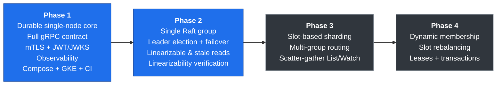

### 4.1 Phase definitions

| Phase | Theme | Capability delivered |
|---|---|---|
| **P1** | **Durable core** | Single-node `gokvx` with the complete gRPC contract, MVCC storage engine, local command log with crash recovery, mTLS, JWT/JWKS authentication and scope authorization, full observability stack, `microservice-1`, Docker Compose, Helm chart, GKE deployment, CI pipeline. |
| **P2** | **Replication** | A single Raft group of *N* nodes replacing the local command log. Leader election, automatic failover, follower catch-up, Raft log compaction and snapshotting, linearizable reads via ReadIndex, optional stale reads, TUI cluster dashboard, linearizability verification under fault injection. |
| **P3** | **Horizontal scale** | Slot-based partitioning across multiple Raft groups, a routing layer, scatter-gather `List` with merged pagination, multiplexed prefix `Watch`, per-shard replication factor. |
| **P4** | **Elasticity and advanced semantics** | Joint-consensus membership changes, live slot rebalancing between groups, leases with TTL and keep-alive, single-shard multi-key transactions. |

### 4.2 Definition of Done

A phase is complete only when **every** criterion below is satisfied.

| # | Criterion |
|---|---|
| DoD-1 | All `MUST` requirements tagged with that phase have `Status: DONE`. |
| DoD-2 | Coverage thresholds in `QA-002` are met. |
| DoD-3 | The integration suite passes against Docker Compose **and** against a `kind` cluster in CI, using the identical test binary. |
| DoD-4 | The linearizability harness (§18.4) passes for the phase's applicable fault scenarios with zero violations across the required run count. |
| DoD-5 | The benchmark suite has been executed and results committed to `docs/benchmarks/` with the documented methodology and hardware profile. |
| DoD-6 | Architecture documentation and all ADRs raised during the phase are merged. |
| DoD-7 | The phase is deployed to the public demonstration environment (§17) and passes its post-deployment smoke suite. |
| DoD-8 | An operational runbook exists covering deployment, rollback, and the failure modes introduced in that phase. |

### 4.3 Forward-compatibility rule

> **KV-API-000** `P1` **MUST** — The Protocol Buffer contract in Appendix A **MUST** be defined in full during Phase 1, including every field required by Phases 2–4 (consistency mode, revision bounds, lease identifiers, transaction primitives, shard hints). Fields whose behaviour is not yet implemented **MUST** be accepted and **MUST** return `UNIMPLEMENTED` with a `google.rpc.ErrorInfo` detail carrying `reason = "FEATURE_NOT_IN_CURRENT_PHASE"`. No field may be added, removed, renumbered, or have its semantics changed after the Phase 1 tag.

Rationale: a consumer built against Phase 1 must continue to work, unmodified, against Phase 4. This constraint is what makes the phased delivery credible rather than a sequence of rewrites.

> **KV-STO-000** `P1` **MUST** — All state mutations **MUST** be expressed as serialized commands applied through a `StateMachine` interface fed by a `CommandLog` interface. Phase 1 supplies a single-node file-backed `CommandLog`; Phase 2 replaces it with the Raft log. No mutation path may bypass this interface.

---

## 5. System Context

### 5.1 Context diagram

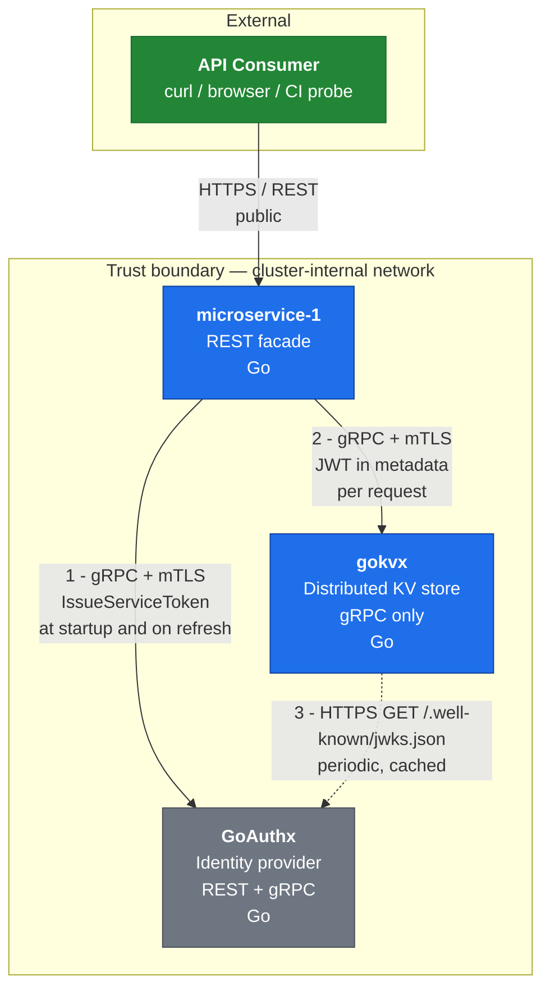

### 5.2 Coupling constraints

| Constraint | Statement |
|---|---|
| C-1 | `gokvx` **MUST NOT** contain any reference to GoAuthx in code, configuration defaults, or dependencies. Its only knowledge of an issuer is the configured `issuer_url` and `jwks_url`. |
| C-2 | GoAuthx **MUST NOT** call `gokvx` or `microservice-1`. All coupling is inbound to GoAuthx. |
| C-3 | `gokvx` **MUST NOT** make a synchronous call to any identity provider on the request path. JWKS retrieval is a background activity. |
| C-4 | `microservice-1` **MUST NOT** call GoAuthx as part of serving an inbound REST request. Token acquisition is decoupled from request handling. |

### 5.3 Actors and identities

| Identity | Type | Credential | Scopes |
|---|---|---|---|
| `svc-microservice-1` | Service account | X.509 client certificate + service-account secret | `kv:read`, `kv:write` |
| `svc-benchmark` | Service account | X.509 client certificate + service-account secret | `kv:read`, `kv:write` |
| `svc-observer` | Service account | X.509 client certificate + service-account secret | `kv:read` |
| `gokvx` node | Peer node | X.509 certificate with SAN in the node SAN allowlist | n/a — peer authorization is certificate-based |

---

## 6. Solution Architecture

### 6.1 gokvx internal decomposition

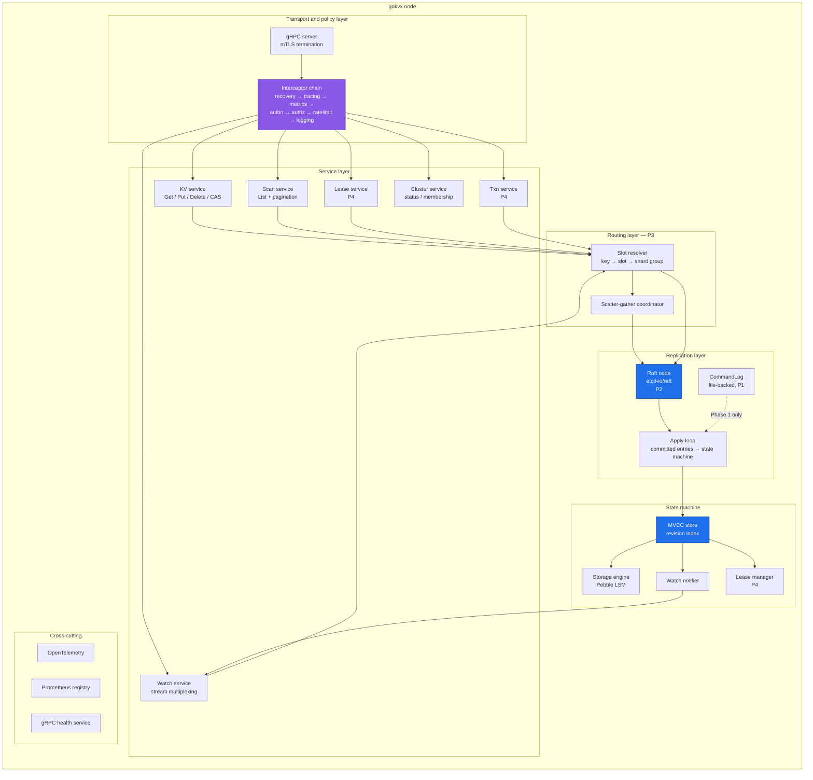

### 6.2 Layering rules

| ID | Rule |
|---|---|
| A-1 | The service layer **MUST NOT** access the storage engine directly. All reads go through the MVCC store; all writes go through the replication layer. |
| A-2 | The state machine **MUST** be deterministic. Given an identical command sequence it **MUST** produce byte-identical state. Wall-clock time, random values, map iteration order, and hostnames **MUST NOT** influence applied state. Any time-dependent value (e.g. a lease expiry instant) **MUST** be carried inside the command as proposed by the leader. |
| A-3 | The replication layer **MUST NOT** depend on any package in the transport layer. |
| A-4 | Every package boundary crossed by a request **MUST** propagate `context.Context`, including deadline and trace context. |
| A-5 | Errors crossing a layer boundary **MUST** be wrapped with `%w` and **MUST** carry a typed sentinel from `internal/kverr`. Only the transport layer converts errors to gRPC status codes. |

### 6.3 Write path

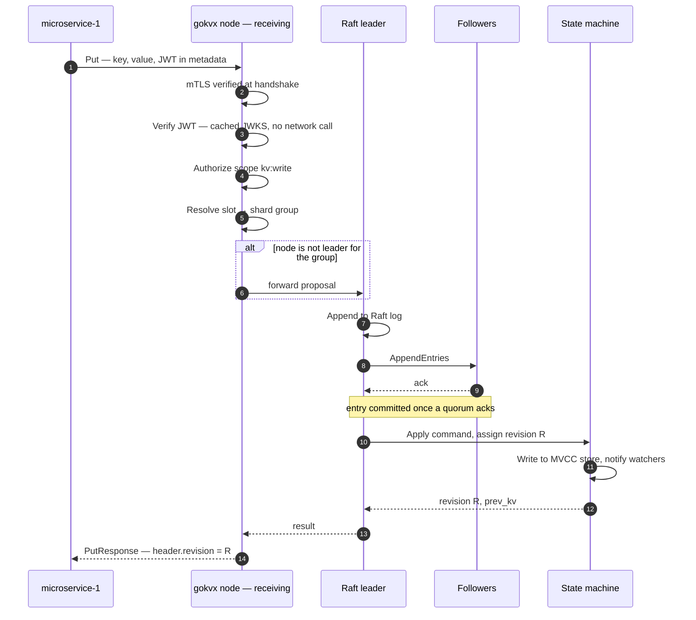

### 6.4 Read path and consistency modes

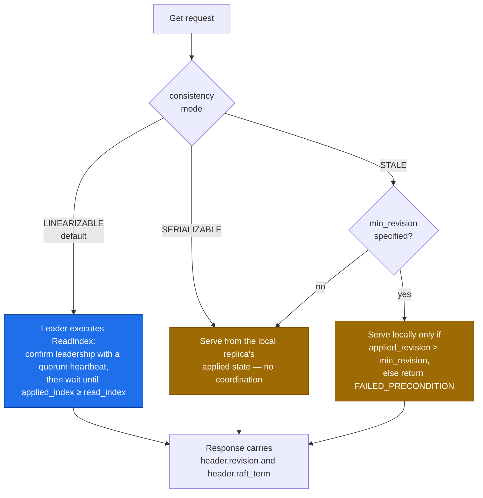

> **Design note.** `SERIALIZABLE` and `STALE` differ in intent: `SERIALIZABLE` is an explicit request for a possibly-stale local read; `STALE` additionally permits the client to assert a lower bound on acceptable staleness via `min_revision`, which converts silent staleness into an explicit, detectable error. Every response carries the revision it observed, so clients can implement read-your-writes by threading revisions.

---

## 7. gokvx — Data Model and Key Space

### 7.1 MVCC revision model

`gokvx` uses a multi-version concurrency control model derived from the etcd design. Understanding it is a prerequisite for implementing §8 correctly.

| Concept | Definition |
|---|---|
| **Revision** | A monotonically increasing 64-bit integer, incremented **once per committed command that writes at least one key** within a shard group. It is the logical clock of the store. |
| **`create_revision`** | The revision at which the key's current generation was created. |
| **`mod_revision`** | The revision of the most recent modification to the key. |
| **`version`** | A per-generation counter starting at 1 on creation and incremented on each subsequent write. Reset to 0 on delete. |
| **Tombstone** | A delete writes a tombstone marker at a new revision rather than removing data, which allows `Watch` to observe deletions and historical reads to remain correct until compaction. |
| **Compaction** | Discards all revisions below a compaction point. Reads below the compaction point return `OUT_OF_RANGE`. |

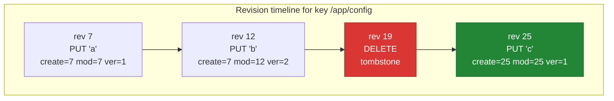

| ID | Phase | Priority | Requirement | Status |
|---|---|---|---|---|
| `KV-DAT-001` | P1 | MUST | The store **MUST** maintain a per-shard-group monotonically increasing revision, incremented exactly once per committed command that writes at least one key — a value or a tombstone. A `Put` **MUST** consume a revision even when the new value equals the current one, and a `Put` with `ignore_value` **MUST** consume one. A transaction **MUST** consume at most one revision, and only when its executed branch writes. A command that writes no key **MUST NOT** consume a revision: reads, a failed comparison (`CompareAndSwap` or `Txn`), a `Delete` that matches no key, `Compact`, `LeaseGrant`, `LeaseKeepAlive`, and a `LeaseRevoke` whose lease has no attached keys. | SPEC |
| `KV-DAT-008` | P1 | MUST | The current revision **MUST** be persisted explicitly in the engine's metadata and in every snapshot, and **MUST NOT** be derived from the key space (for example as the maximum `mod_revision`), which compaction and deletion make unreliable. | SPEC |
| `KV-DAT-002` | P1 | MUST | Every key entry **MUST** record `create_revision`, `mod_revision`, `version`, `value`, and `lease_id`. | SPEC |
| `KV-DAT-003` | P1 | MUST | A delete **MUST** write a tombstone at a new revision rather than erasing the key's history. | SPEC |
| `KV-DAT-004` | P1 | MUST | Read operations **MUST** accept an optional `revision` parameter and serve a consistent historical snapshot at that revision. | SPEC |
| `KV-DAT-005` | P1 | MUST | A read at a revision below the compaction point **MUST** fail with `OUT_OF_RANGE`. | SPEC |
| `KV-DAT-006` | P1 | MUST | `Compact` **MUST** be exposed as an administrative RPC requiring the `kv:admin` scope, and **MUST** be replicated as a command so that all replicas compact identically. | SPEC |
| `KV-DAT-007` | P1 | SHOULD | The node **SHOULD** support automatic periodic compaction retaining a configurable revision window (`storage.auto_compaction_retention`). | SPEC |

### 7.2 Key and value constraints

| ID | Phase | Priority | Requirement | Status |
|---|---|---|---|---|
| `KV-DAT-010` | P1 | MUST | Keys **MUST** be treated as opaque byte strings and **MUST** be ordered lexicographically by unsigned byte value. | SPEC |
| `KV-DAT-011` | P1 | MUST | The maximum key length **MUST** be configurable with a default of 1 KiB; the maximum value size **MUST** be configurable with a default of 1 MiB. Exceeding either **MUST** return `INVALID_ARGUMENT`. | SPEC |
| `KV-DAT-012` | P1 | MUST | An empty key **MUST** be rejected with `INVALID_ARGUMENT`, except where the protocol explicitly assigns it a range-boundary meaning (§8.3). | SPEC |
| `KV-DAT-013` | P1 | MUST | The maximum total request message size **MUST** be configurable with a default of 4 MiB, enforced by the gRPC server. | SPEC |

### 7.3 Partition keys and slot assignment

Consistent hashing over whole keys destroys prefix locality, which would make `List` and prefix `Watch` inherently scatter-gather. `gokvx` therefore adopts an explicit, client-controlled colocation mechanism.

| ID | Phase | Priority | Requirement | Status |
|---|---|---|---|---|
| `KV-DAT-020` | P1 | MUST | The key space **MUST** be divided into a fixed number of **slots**, configurable at cluster bootstrap and immutable thereafter, defaulting to `16384`. | WIP |
| `KV-DAT-021` | P1 | MUST | The slot for a key **MUST** be computed as `crc32c(hash_input) mod slot_count`, where `hash_input` is the substring between the first `{` and the first subsequent `}` if such a non-empty substring exists, and the entire key otherwise. | DONE |
| `KV-DAT-022` | P1 | MUST | The slot function **MUST** be implemented and unit-tested in Phase 1 even though a Phase 1 cluster maps all slots to a single group, so that keys written in Phase 1 remain correctly routable after Phase 3. | DONE |
| `KV-DAT-023` | P3 | MUST | Slots **MUST** be assigned to shard groups by an authoritative slot map replicated in the cluster metadata group. | SPEC |

**Worked example.**

| Key | Hash input | Consequence |
|---|---|---|
| `/app/config` | `/app/config` | Slot determined by the whole key. |
| `{tenant-42}/users/1` | `tenant-42` | Colocated with every other `{tenant-42}` key. |
| `{tenant-42}/users/2` | `tenant-42` | Same slot as above — a prefix scan over `{tenant-42}/users/` is a single-group operation. |
| `{}/x` | `{}/x` | Empty braces are not a partition key; the whole key is hashed. |

> **Guidance for consumers.** A prefix scan is served by a single shard group — and is therefore cheap, ordered, and cheaply paginated — if and only if the prefix contains a complete partition key. Otherwise it degrades to a scatter-gather across all groups (§8.3).

---

## 8. gokvx — API Surface

### 8.1 Protocol

| ID | Phase | Priority | Requirement | Status |
|---|---|---|---|---|
| `KV-API-001` | P1 | MUST | All client and inter-node communication **MUST** use gRPC over HTTP/2. No REST, GraphQL, or other client protocol may be exposed. | SPEC |
| `KV-API-002` | P1 | MUST | The contract **MUST** be defined in versioned Protocol Buffers under `proto/gokvx/v1/`, published as the single source of truth for all consumers, and generated code **MUST** be committed to the repository. | DONE |
| `KV-API-003` | P1 | MUST | The build **MUST** enforce backwards compatibility using `buf breaking` against the previous tagged release, and CI **MUST** fail on any breaking change. | DONE |
| `KV-API-004` | P1 | MUST | Every response **MUST** carry a `ResponseHeader` containing `cluster_id`, `member_id`, `revision`, and `raft_term`. | SPEC |
| `KV-API-005` | P1 | SHOULD | The server **SHOULD** enable gRPC server reflection when `auth.mode` is `disabled`, and **MUST NOT** enable it otherwise. | SPEC |
| `KV-API-006` | P1 | MUST | The server **MUST** enforce a configurable maximum concurrent stream count and connection idle timeout, and **MUST** send HTTP/2 keepalive pings on a configurable interval. | SPEC |
| `KV-API-007` | P1 | MUST | The server **MUST** honour client deadlines. A request whose context is cancelled **MUST** abort its work promptly and **MUST NOT** leave a proposal in flight without a corresponding cleanup path. | SPEC |

### 8.2 Single-key operations

| ID | Phase | Priority | Requirement | Status |
|---|---|---|---|---|
| `KV-API-010` | P1 | MUST | `Get` **MUST** return the value, metadata, and `ResponseHeader` for a key, or a response with `count = 0` when absent. Absence **MUST NOT** be signalled as a gRPC error. | SPEC |
| `KV-API-011` | P1 | MUST | `Get` **MUST** support `consistency` ∈ {`LINEARIZABLE` (default), `SERIALIZABLE`, `STALE`}, `revision` for historical reads, and `keys_only` to suppress value transfer. | SPEC |
| `KV-API-012` | P1 | MUST | `Put` **MUST** write a value and return the new revision, and **MUST** optionally return the previous key-value pair when `prev_kv` is set. | SPEC |
| `KV-API-013` | P1 | MUST | `Put` **MUST** support `ignore_value`, which updates only the attached lease and leaves the value unchanged, returning `INVALID_ARGUMENT` if the key does not exist. | SPEC |
| `KV-API-014` | P1 | MUST | `Delete` **MUST** remove a key or a range and return the number of keys deleted, and **MUST** optionally return the deleted pairs when `prev_kv` is set. | SPEC |
| `KV-API-015` | P1 | MUST | `Put` and `Delete` **MUST** be linearizable: once a response is returned, every subsequent linearizable read **MUST** observe the effect. | SPEC |

### 8.3 Range scans

| ID | Phase | Priority | Requirement | Status |
|---|---|---|---|---|
| `KV-API-020` | P1 | MUST | `List` **MUST** support prefix scanning and explicit `[range_start, range_end)` half-open ranges. A `range_end` of a single zero byte **MUST** denote "to the end of the key space". | SPEC |
| `KV-API-021` | P1 | MUST | `List` **MUST** support `limit`, `keys_only`, `count_only`, `sort_order` ∈ {`ASCEND`, `DESCEND`}, `sort_target` ∈ {`KEY`, `CREATE`, `MOD`, `VERSION`}, `min_mod_revision`, and `max_mod_revision`. | SPEC |
| `KV-API-022` | P1 | MUST | `List` **MUST** support pagination via an opaque `page_token`. The token **MUST** be an encoded, integrity-protected structure carrying the snapshot revision and per-group cursors. Clients **MUST NOT** be able to depend on its internal format. | SPEC |
| `KV-API-023` | P1 | MUST | All pages of a paginated scan **MUST** be served from the snapshot revision recorded in the first page's token, so that a paginated scan is a consistent point-in-time view. If that revision has been compacted, the server **MUST** return `OUT_OF_RANGE`. | SPEC |
| `KV-API-024` | P3 | MUST | When a range spans multiple shard groups, the coordinating node **MUST** perform a scatter-gather across the groups, merge results preserving the requested sort order, and encode each group's cursor in the page token. | SPEC |
| `KV-API-025` | P3 | SHOULD | The response **SHOULD** report `groups_queried` so that consumers can detect unintentionally fanned-out scans. | SPEC |

### 8.4 Conditional writes

| ID | Phase | Priority | Requirement | Status |
|---|---|---|---|---|
| `KV-API-030` | P1 | MUST | `CompareAndSwap` **MUST** atomically apply a write if and only if the specified comparison holds, with the comparison and the write committed as a single replicated command. | SPEC |
| `KV-API-031` | P1 | MUST | The comparison target **MUST** support `VALUE`, `VERSION`, `CREATE_REVISION`, `MOD_REVISION`, and `LEASE`, with operators `EQUAL`, `NOT_EQUAL`, `GREATER`, and `LESS`. | SPEC |
| `KV-API-032` | P1 | MUST | A comparison against `MOD_REVISION` equal to `0` **MUST** mean "the key does not exist", providing create-if-absent semantics. | SPEC |
| `KV-API-033` | P1 | MUST | A failed comparison **MUST** return a successful RPC with `succeeded = false` and the current key state, **not** a gRPC error. This allows a client to retry without an additional read. | SPEC |

### 8.5 Watch

| ID | Phase | Priority | Requirement | Status |
|---|---|---|---|---|
| `KV-API-040` | P1 | MUST | `Watch` **MUST** be a bidirectional streaming RPC allowing a client to create and cancel multiple logical watches over one stream. | SPEC |
| `KV-API-041` | P1 | MUST | A watch **MUST** support a single key, a prefix, or an explicit range. | SPEC |
| `KV-API-042` | P1 | MUST | A watch **MUST** accept a `start_revision`. When supplied, the server **MUST** first replay all historical events from that revision before delivering live events, and **MUST** deliver them in revision order with no gaps. | SPEC |
| `KV-API-043` | P1 | MUST | If `start_revision` precedes the compaction point, the server **MUST** send a `Canceled` event with `compact_revision` set, and **MUST NOT** silently skip events. | SPEC |
| `KV-API-044` | P1 | MUST | Events **MUST** be delivered in non-decreasing revision order per watch, and all events sharing a revision **MUST** be delivered in one message so that a transaction is observed atomically. | SPEC |
| `KV-API-045` | P1 | MUST | The server **MUST** bound per-stream buffering. When a client is too slow and the buffer limit is exceeded, the server **MUST** cancel that watch with `RESOURCE_EXHAUSTED` rather than growing memory without limit. | SPEC |
| `KV-API-046` | P1 | SHOULD | `Watch` **SHOULD** support `prev_kv` and a `progress_notify` option that emits a periodic empty event carrying the current revision, letting idle clients checkpoint their position. | SPEC |
| `KV-API-047` | P3 | MUST | A watch spanning multiple shard groups **MUST** be multiplexed across per-group watches. The server **MUST** document that ordering is guaranteed per group, not globally, and **MUST** expose each event's originating group. | SPEC |

### 8.6 Transactions

| ID | Phase | Priority | Requirement | Status |
|---|---|---|---|---|
| `KV-API-050` | P4 | MUST | `Txn` **MUST** accept a list of comparisons and two operation lists (`on_success`, `on_failure`), evaluate all comparisons atomically, and execute exactly one branch as a single replicated command. | SPEC |
| `KV-API-051` | P4 | MUST | All keys referenced by a single `Txn` **MUST** resolve to one shard group. A transaction spanning groups **MUST** be rejected with `FAILED_PRECONDITION` and an `ErrorInfo` reason of `CROSS_SHARD_TXN_UNSUPPORTED`. | SPEC |
| `KV-API-052` | P4 | MUST | Transactions **MUST** support nesting to a configurable depth, defaulting to 8, and **MUST** reject deeper nesting with `INVALID_ARGUMENT`. | SPEC |
| `KV-API-053` | P4 | MUST | All mutations within one `Txn` **MUST** share a single revision. | SPEC |

### 8.7 Leases

| ID | Phase | Priority | Requirement | Status |
|---|---|---|---|---|
| `KV-API-060` | P4 | MUST | `LeaseGrant` **MUST** create a lease with a TTL and return a cluster-unique 64-bit lease ID. | SPEC |
| `KV-API-061` | P4 | MUST | `LeaseKeepAlive` **MUST** be a bidirectional stream renewing a lease and returning the granted TTL, which **MAY** be lower than requested when a server-side minimum or maximum applies. | SPEC |
| `KV-API-062` | P4 | MUST | Expiry **MUST** be enacted by the shard leader proposing a replicated `LeaseRevoke` command. A follower **MUST NOT** expire a lease from its local clock. | SPEC |
| `KV-API-063` | P4 | MUST | Revoking or expiring a lease **MUST** atomically delete every key attached to it in a single replicated command, and those deletions **MUST** be observable through `Watch`. | SPEC |
| `KV-API-064` | P4 | MUST | `LeaseTimeToLive` **MUST** report the remaining TTL and, when requested, the keys attached to the lease. | SPEC |
| `KV-API-065` | P4 | MUST | A newly elected leader **MUST** reset all lease expiry timers to a full TTL, so that a failover does not cause a mass expiry. | SPEC |

### 8.8 Cluster service

| ID | Phase | Priority | Requirement | Status |
|---|---|---|---|---|
| `KV-API-070` | P1 | MUST | `Status` **MUST** report node ID, version, cluster ID, current leader, Raft term, committed index, applied index, database size, and current revision. | SPEC |
| `KV-API-071` | P2 | MUST | `MemberList` **MUST** report all known members with their peer and client addresses and learner status. | SPEC |
| `KV-API-072` | P4 | MUST | `MemberAdd`, `MemberRemove`, `MemberUpdate`, and `MemberPromote` **MUST** be exposed and **MUST** require the `kv:admin` scope. | SPEC |
| `KV-API-073` | P3 | MUST | `ShardMap` **MUST** return the current slot-to-group assignment together with a monotonic slot-map version. | SPEC |
| `KV-API-074` | P3 | SHOULD | When a request arrives for a slot the node does not own, the server **SHOULD** either transparently forward it or return `FAILED_PRECONDITION` with an `ErrorInfo` carrying the correct group's endpoints, enabling a smart client. The chosen behaviour **MUST** be configurable and documented. | SPEC |

---

## 9. gokvx — Storage and Durability

### 9.1 Two distinct logs

A frequent source of confusion in this class of system is the conflation of the *replication log* with the *storage engine's* write-ahead log. `gokvx` has both, and they serve different purposes.

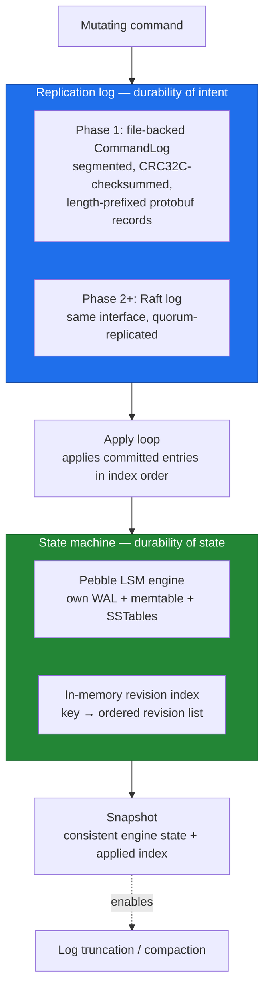

| ID | Phase | Priority | Requirement | Status |
|---|---|---|---|---|
| `KV-STO-001` | P1 | MUST | The state machine **MUST** persist data in an embedded LSM-tree engine. The reference implementation **MUST** use `cockroachdb/pebble`. The engine **MUST** sit behind an `Engine` interface so it can be substituted in tests. | SPEC |
| `KV-STO-002` | P1 | MUST | The replication log **MUST** be segmented into files of a configurable size, each record length-prefixed and protected by a CRC32C checksum over the payload. | SPEC |
| `KV-STO-003` | P1 | MUST | On startup the node **MUST** recover by opening the engine, reading the persisted `applied_index`, and replaying every log record with a higher index. Recovery **MUST** be idempotent: replaying the same records twice **MUST** produce identical state. | SPEC |
| `KV-STO-004` | P1 | MUST | A record whose checksum fails **MUST** terminate replay at that point. Trailing corrupt or torn records **MUST** be truncated, and the event **MUST** be logged at `WARN` with the offset. A checksum failure in the middle of an otherwise valid log **MUST** cause startup to abort with a non-zero exit code. | SPEC |
| `KV-STO-005` | P1 | MUST | The fsync policy **MUST** be configurable as `always` (fsync before acknowledging each write), `interval` (fsync every *N* milliseconds), or `os` (no explicit fsync). The default **MUST** be `always`. The durability implication of each setting **MUST** be documented in the README, and the node **MUST** log a `WARN` at startup when not running with `always`. | SPEC |
| `KV-STO-006` | P1 | MUST | The node **MUST** take a snapshot when the number of applied entries since the last snapshot exceeds a configurable threshold, defaulting to 10,000, or when a configurable interval elapses. | SPEC |
| `KV-STO-007` | P1 | MUST | A snapshot **MUST** be written atomically: written to a temporary path, fsynced, then renamed, with the containing directory fsynced. A partially written snapshot **MUST NOT** be selectable during recovery. | SPEC |
| `KV-STO-008` | P1 | MUST | Log segments entirely covered by a durable snapshot **MUST** be eligible for deletion, and a configurable number of segments **MUST** be retained beyond that point to aid follower catch-up and debugging. | SPEC |
| `KV-STO-009` | P1 | MUST | Startup **MUST** fail fast with a clear message if the data directory was written by an incompatible storage format version. A `storage_version` marker file **MUST** be maintained. | SPEC |
| `KV-STO-010` | P1 | MUST | The node **MUST** enforce a configurable database size quota. On exceeding it, the node **MUST** reject writes with `RESOURCE_EXHAUSTED` while continuing to serve reads, and **MUST** raise an alertable metric. | SPEC |
| `KV-STO-011` | P2 | MUST | Snapshot transfer to a lagging follower **MUST** be streamed in chunks with flow control, **MUST** be resumable or safely restartable, and **MUST NOT** buffer the entire snapshot in memory on either side. | SPEC |
| `KV-STO-012` | P1 | SHOULD | The revision index **SHOULD** be reconstructible from the engine on startup, and the reconstruction time **SHOULD** be reported as a startup metric. | SPEC |

### 9.2 Crash-consistency verification

| ID | Phase | Priority | Requirement | Status |
|---|---|---|---|---|
| `KV-STO-020` | P1 | MUST | A crash-recovery test suite **MUST** exist that kills the process with `SIGKILL` at randomized points during a sustained write workload, restarts it, and asserts that every acknowledged write is present and no unacknowledged write is partially applied. | SPEC |
| `KV-STO-021` | P1 | MUST | The suite **MUST** include a torn-write test that truncates the final log record at a random byte offset and asserts clean recovery. | SPEC |
| `KV-STO-022` | P1 | SHOULD | The suite **SHOULD** include a bit-flip test asserting that corruption is detected rather than silently applied. | SPEC |

---

## 10. gokvx — Consensus, Replication and Sharding

### 10.1 Raft

| ID | Phase | Priority | Requirement | Status |
|---|---|---|---|---|
| `KV-CON-001` | P2 | MUST | Consensus **MUST** be provided by the `etcd-io/raft` library. The implementation owns the storage, transport, tick loop, and state machine; the algorithm itself **MUST NOT** be reimplemented. See [ADR-0002](#21-architecture-decision-records). | SPEC |
| `KV-CON-002` | P2 | MUST | Each shard group **MUST** be an independent Raft group with its own log, snapshot, and leader. | SPEC |
| `KV-CON-003` | P2 | MUST | Inter-node Raft transport **MUST** run over gRPC with mTLS, using a streaming RPC per peer with message batching and backpressure. | SPEC |
| `KV-CON-004` | P2 | MUST | The election timeout, heartbeat interval, and tick interval **MUST** be configurable, with defaults documented and justified relative to expected intra-zone network latency. Election timeout **MUST** be at least ten times the heartbeat interval. | SPEC |
| `KV-CON-005` | P2 | MUST | The implementation **MUST** enable Raft PreVote to prevent a partitioned node from disrupting a healthy cluster by incrementing its term. | SPEC |
| `KV-CON-006` | P2 | MUST | The implementation **MUST** enable CheckQuorum so that a leader that has lost contact with a quorum steps down rather than continuing to serve stale linearizable reads. | SPEC |
| `KV-CON-007` | P2 | MUST | Linearizable reads **MUST** use the ReadIndex protocol. A leader **MUST NOT** serve a linearizable read from local state without confirming leadership via a quorum heartbeat and waiting until `applied_index ≥ read_index`. | SPEC |
| `KV-CON-008` | P2 | MUST | A write received by a follower **MUST** either be forwarded to the leader or rejected with `FAILED_PRECONDITION` carrying the leader's address. The behaviour **MUST** be configurable and **MUST** default to forwarding. | SPEC |
| `KV-CON-009` | P2 | MUST | When no leader is known, the node **MUST** fail requests with `UNAVAILABLE` after a configurable wait, **MUST NOT** block indefinitely, and **MUST** respect the caller's deadline. | SPEC |
| `KV-CON-010` | P2 | MUST | Every proposal **MUST** carry a unique request identifier so that a retried proposal is applied at most once. The state machine **MUST** maintain a bounded deduplication window and **MUST** document its size and eviction policy. | SPEC |
| `KV-CON-011` | P2 | MUST | The apply loop **MUST** be single-threaded per group and **MUST** apply entries strictly in index order. | SPEC |
| `KV-CON-012` | P2 | MUST | The node **MUST** persist Raft `HardState` and new log entries durably **before** sending corresponding messages to peers, as required by the Raft safety argument. | SPEC |
| `KV-CON-013` | P2 | SHOULD | On graceful shutdown a leader **SHOULD** transfer leadership to the most up-to-date follower before exiting, to minimise unavailability during rolling restarts. | SPEC |
| `KV-CON-014` | P2 | MUST | The replication factor **MUST** be configurable per shard group. Deployment documentation **MUST** state that a group of size *N* tolerates `floor((N-1)/2)` failures and that even-sized groups are discouraged. | SPEC |

### 10.2 Failover behaviour

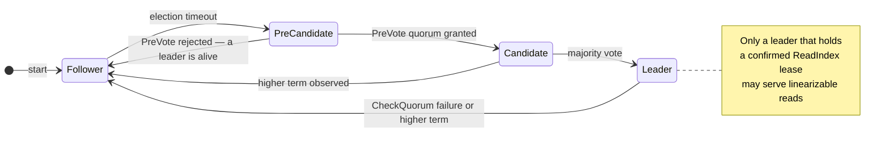

| ID | Phase | Priority | Requirement | Status |
|---|---|---|---|---|
| `KV-CON-020` | P2 | MUST | Loss of the leader **MUST** trigger automatic re-election without operator intervention. | SPEC |
| `KV-CON-021` | P2 | MUST | Median time to recover write availability after a leader kill **MUST** be under 3 seconds with default timing parameters in an intra-zone deployment, and this **MUST** be verified by an automated test. | SPEC |
| `KV-CON-022` | P2 | MUST | A restarted or newly joined node **MUST** catch up via log replication where possible, and via snapshot transfer when the required entries have been compacted. | SPEC |
| `KV-CON-023` | P2 | MUST | No committed write **MUST** ever be lost or reordered across any number of leader changes. This **MUST** be verified by the linearizability harness (§18.4). | SPEC |

### 10.3 Sharding

```mermaid
flowchart TB
    key["Key: &#123;tenant-42&#125;/users/7"] --> extract["Extract partition key<br/>tenant-42"]
    extract --> hash["crc32c mod 16384"]
    hash --> slot["Slot N (illustrative)"]
    slot --> map["Slot map<br/>replicated in the metadata group"]

    map --> g0["Group 0<br/>slots 0..5460<br/>3 replicas"]
    map --> g1["Group 1<br/>slots 5461..10921<br/>3 replicas"]
    map --> g2["Group 2<br/>slots 10922..16383<br/>3 replicas"]

    slot -.->|resolves to| g1

    style g1 fill:#1f6feb,stroke:#0d419d,color:#ffffff
    style map fill:#8957e5,stroke:#6639ba,color:#ffffff
```

| ID | Phase | Priority | Requirement | Status |
|---|---|---|---|---|
| `KV-CON-030` | P3 | MUST | Slot-to-group assignment **MUST** be stored in an authoritative, replicated slot map carrying a monotonically increasing version. | SPEC |
| `KV-CON-031` | P3 | MUST | Every node **MUST** be able to resolve any key to its owning group, and **MUST** either forward or redirect requests for slots it does not own, per `KV-API-074`. | SPEC |
| `KV-CON-032` | P3 | MUST | Responses **MUST** carry the slot-map version so that clients can detect and refresh a stale routing cache. | SPEC |
| `KV-CON-033` | P3 | MUST | A cluster **MUST** be able to bootstrap with a single group owning all slots, and a Phase 1 or Phase 2 data directory **MUST** be readable by a Phase 3 binary without migration. | SPEC |
| `KV-CON-034` | P3 | SHOULD | The number of groups **SHOULD** be configurable at bootstrap, with an even initial slot distribution. | SPEC |

> **Why fixed slots rather than a consistent hash ring?** A hash ring rebalances by moving an arbitrary, node-dependent key range on every topology change, which is difficult to reason about and difficult to make atomic. A fixed slot space decouples the hash function from the topology: the key-to-slot mapping is permanent, and elasticity becomes the much simpler problem of moving whole slots between groups. This is the approach taken by Redis Cluster and, in spirit, by most production sharded stores. See [ADR-0003](#21-architecture-decision-records).

### 10.4 Dynamic membership

| ID | Phase | Priority | Requirement | Status |
|---|---|---|---|---|
| `KV-CON-040` | P4 | MUST | Membership changes within a group **MUST** use Raft joint consensus (`ConfChangeV2`) rather than single-node add or remove, so that no intermediate configuration can produce a split quorum. | SPEC |
| `KV-CON-041` | P4 | MUST | A new member **MUST** first join as a non-voting learner and **MUST** be promoted to voter only once its log lag falls below a configurable threshold. | SPEC |
| `KV-CON-042` | P4 | MUST | Adding or removing a node **MUST NOT** require a restart of any existing node. | SPEC |
| `KV-CON-043` | P4 | MUST | The cluster **MUST** refuse a membership change that would leave a group without a quorum, returning `FAILED_PRECONDITION`. | SPEC |
| `KV-CON-044` | P4 | MUST | Membership state **MUST** survive a full cluster restart and **MUST** be recovered from the Raft log and snapshots, not from static configuration. | SPEC |

### 10.5 Slot rebalancing

| ID | Phase | Priority | Requirement | Status |
|---|---|---|---|---|
| `KV-CON-050` | P4 | MUST | Slot migration **MUST** proceed through the explicit states `STABLE → MIGRATING → HANDOVER → STABLE`, each transition recorded in the replicated slot map. | SPEC |
| `KV-CON-051` | P4 | MUST | During `MIGRATING` the source group **MUST** continue serving reads and writes for the slot while a snapshot of the slot's key range is streamed to the destination group. | SPEC |
| `KV-CON-052` | P4 | MUST | During `HANDOVER` the source group **MUST** reject writes for the slot with a retryable status while the tail of changes is applied at the destination, and the window **MUST** be bounded by a configurable timeout after which the migration is aborted and rolled back. | SPEC |
| `KV-CON-053` | P4 | MUST | A migration **MUST NOT** lose, duplicate, or reorder writes. This **MUST** be verified by a dedicated test running a continuous write workload across a migration. | SPEC |
| `KV-CON-054` | P4 | MUST | An aborted or crashed migration **MUST** be recoverable to a consistent state on restart, with the slot deterministically owned by exactly one group. | SPEC |
| `KV-CON-055` | P4 | SHOULD | An advisory rebalancing planner **SHOULD** propose slot moves to equalise key count or byte size across groups, and **MUST** require explicit operator confirmation before executing. | SPEC |

### 10.6 Deferred: cross-shard transactions

Cross-shard atomicity requires a two-phase commit coordinator layered over independent Raft groups, with its own durable coordinator state, participant timeout handling, and recovery protocol. It is deliberately excluded (§2.2, NG-1). `KV-API-051` makes the limitation explicit at the API boundary rather than silently offering weaker guarantees than a client would assume — an implicit downgrade of atomicity is a worse outcome than an explicit rejection.

---

## 11. gokvx — Security

### 11.1 Security model

`gokvx` applies two independent controls to every request. **Mutual TLS establishes that the caller is an approved workload**; **the JWT establishes which service account is acting and what it may do**. Neither substitutes for the other: a compromised certificate without a valid token grants nothing, and a leaked token presented from outside the mesh cannot complete the handshake.

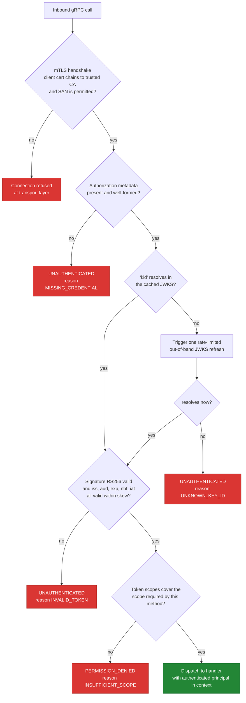

### 11.2 Transport security

| ID | Phase | Priority | Requirement | Status |
|---|---|---|---|---|
| `KV-SEC-001` | P1 | MUST | All client-facing and inter-node gRPC traffic **MUST** use mutual TLS. Plaintext gRPC **MUST NOT** be available on any listener except when `auth.mode: disabled` is explicitly set (§11.6). | SPEC |
| `KV-SEC-002` | P1 | MUST | The minimum protocol version **MUST** be TLS 1.3. TLS 1.2 **MAY** be permitted only via explicit configuration, and if permitted the cipher suite list **MUST** be restricted to AEAD suites with forward secrecy. | SPEC |
| `KV-SEC-003` | P1 | MUST | The server **MUST** require and verify a client certificate chaining to a configured CA bundle (`ClientAuth: RequireAndVerifyClientCert`). | SPEC |
| `KV-SEC-004` | P1 | MUST | Peer authorization **MUST** be based on the certificate SAN matched against a configurable allowlist of exact values and patterns. Matching on Common Name alone **MUST NOT** be used. | SPEC |
| `KV-SEC-005` | P1 | MUST | Certificates and CA bundles **MUST** be reloadable without a process restart. The node **MUST** watch the certificate files and atomically swap the credentials on change, logging the new certificate's fingerprint and expiry. | SPEC |
| `KV-SEC-006` | P1 | MUST | The node **MUST** export a metric for the number of seconds until the leaf certificate expires, to permit alerting before expiry. | SPEC |
| `KV-SEC-007` | P1 | SHOULD | The node **SHOULD** support a separate CA bundle for peer connections and for client connections, so that client trust can be scoped independently of cluster trust. | SPEC |

### 11.3 Token verification

| ID | Phase | Priority | Requirement | Status |
|---|---|---|---|---|
| `KV-SEC-010` | P1 | MUST | Clients **MUST** authenticate with a JWT bearer token supplied in the `authorization` gRPC metadata key as `Bearer <token>`. API keys, static shared secrets, and basic authentication **MUST NOT** be supported. | SPEC |
| `KV-SEC-011` | P1 | MUST | Tokens **MUST** be verified locally against public keys fetched from the configured JWKS endpoint. `gokvx` **MUST NOT** make a synchronous network call to the issuer during request handling. | SPEC |
| `KV-SEC-012` | P1 | MUST | The JWKS cache **MUST** be refreshed on a configurable interval, defaulting to 15 minutes, in a background goroutine. Refresh failure **MUST NOT** invalidate the existing cache; the node **MUST** continue serving with the last known good key set and **MUST** raise a metric and a `WARN` log. | SPEC |
| `KV-SEC-013` | P1 | MUST | On encountering an unknown `kid`, the node **MUST** trigger at most one out-of-band refresh, which **MUST** be rate-limited to a configurable minimum interval, defaulting to 60 seconds, to prevent a token-flood from becoming a denial-of-service amplifier against the issuer. | SPEC |
| `KV-SEC-014` | P1 | MUST | The accepted signing algorithm set **MUST** be configured explicitly and **MUST** default to `["RS256"]`. Tokens with `alg: none`, or with any algorithm outside the configured set, **MUST** be rejected without further processing. The algorithm **MUST** be validated against configuration, never taken from the token header alone. | SPEC |
| `KV-SEC-015` | P1 | MUST | The node **MUST** validate `iss` against the configured issuer, `aud` against the configured audience, and `exp`, `nbf`, and `iat` against the current time with a configurable clock skew tolerance defaulting to 60 seconds. A token lacking `exp` **MUST** be rejected. | SPEC |
| `KV-SEC-016` | P1 | MUST | A token **MUST** be rejected if its header omits `kid`, or if `kid` does not resolve to a key in the cache after the permitted refresh. | SPEC |
| `KV-SEC-017` | P1 | MUST | A successfully verified token's claims **MAY** be cached keyed by a hash of the token to avoid repeated signature verification. The cache entry **MUST** expire no later than the token's `exp` and **MUST** be bounded in size with LRU eviction. | SPEC |
| `KV-SEC-018` | P1 | MUST | JWKS retrieval **MUST** occur over HTTPS with full certificate verification, **MUST** apply a request timeout and a response size limit, and **MUST** reject a document containing a key type or size below configured minimums (minimum RSA modulus 2048 bits). | SPEC |
| `KV-SEC-019` | P1 | MUST | The node **MUST** fail to start if `auth.mode` is `enabled` and the JWKS endpoint cannot be reached during a bounded startup window, rather than starting in a state where all requests fail. | SPEC |

### 11.4 Authorization

| ID | Phase | Priority | Requirement | Status |
|---|---|---|---|---|
| `KV-SEC-020` | P1 | MUST | Authorization **MUST** be enforced by a gRPC unary and stream interceptor applied to every method, driven by a declarative method-to-required-scope table. A method absent from the table **MUST** be denied by default. | SPEC |
| `KV-SEC-021` | P1 | MUST | Scopes **MUST** be read from the `scope` claim as a space-delimited string per OAuth 2.0 convention. A `scopes` array claim **MAY** additionally be accepted. | SPEC |
| `KV-SEC-022` | P1 | MUST | The defined scopes **MUST** be `kv:read`, `kv:write`, `kv:watch`, and `kv:admin`. `kv:write` **MUST NOT** implicitly grant `kv:read`. | SPEC |
| `KV-SEC-023` | P1 | MUST | The scope mapping **MUST** be: `Get`, `List` → `kv:read`; `Put`, `Delete`, `CompareAndSwap`, `Txn`, lease operations → `kv:write`; `Watch` → `kv:watch`; `Compact`, member operations, slot-map mutations → `kv:admin`; `Status`, `MemberList`, `ShardMap`, `LeaseTimeToLive`, and health → no scope beyond successful authentication. `MemberAdd`, `MemberRemove`, `MemberUpdate`, `MemberPromote`, and `MoveSlots` → `kv:admin`. | SPEC |
| `KV-SEC-024` | P1 | MUST | A `Txn` containing any mutating operation **MUST** require `kv:write` even if the executed branch performs only reads. Authorization **MUST** be evaluated against the request's potential effect, not its realised effect. | SPEC |
| `KV-SEC-025` | P1 | SHOULD | The system **SHOULD** support optional key-prefix restriction per principal, declared via a `kv_prefixes` claim, denying access to keys outside the permitted prefixes. When the claim is absent, no prefix restriction applies. | SPEC |
| `KV-SEC-026` | P1 | MUST | For a streaming RPC, authorization **MUST** be evaluated at stream establishment, and the server **MUST** terminate an open stream once the authenticating token's `exp` has passed. A long-lived stream **MUST NOT** outlive its credential. | SPEC |

### 11.5 Hardening and abuse resistance

| ID | Phase | Priority | Requirement | Status |
|---|---|---|---|---|
| `KV-SEC-030` | P1 | MUST | Authentication and authorization failures **MUST NOT** disclose whether a key exists, which claim failed, or any internal detail. The client receives a stable status code and an `ErrorInfo` reason drawn from a fixed enumeration; the diagnostic detail is recorded in the server log only. | SPEC |
| `KV-SEC-031` | P1 | MUST | Tokens, token fragments, signatures, private keys, certificate private material, and values **MUST NOT** appear in logs, traces, metric labels, or error messages at any level. A CI check **MUST** scan for regressions. | SPEC |
| `KV-SEC-032` | P1 | MUST | A per-principal token-bucket rate limiter **MUST** be applied, configurable by operation class, returning `RESOURCE_EXHAUSTED` with a `RetryInfo` detail when exceeded. | SPEC |
| `KV-SEC-033` | P1 | MUST | Concurrent streams per principal and total open watches **MUST** be bounded by configuration. | SPEC |
| `KV-SEC-034` | P1 | MUST | The container image **MUST** run as a non-root user with a read-only root filesystem, no privilege escalation, and all Linux capabilities dropped. | SPEC |
| `KV-SEC-035` | P1 | MUST | A security audit log **MUST** record every authentication failure, authorization denial, admin operation, and certificate reload, with principal, method, remote SAN, trace ID, and outcome. | SPEC |
| `KV-SEC-036` | P1 | SHOULD | Constant-time comparison **SHOULD** be used for any secret-material comparison, and token cache lookups **SHOULD** use a keyed hash rather than the raw token as the map key. | SPEC |

### 11.6 Development mode

| ID | Phase | Priority | Requirement | Status |
|---|---|---|---|---|
| `KV-SEC-040` | P1 | MUST | An `auth.mode: disabled` setting **MUST** exist for local development and testing, disabling both mTLS and token verification. | SPEC |
| `KV-SEC-041` | P1 | MUST | When `auth.mode` is `disabled`, the node **MUST** additionally require `environment: development` to be set, **MUST** refuse to start otherwise, **MUST** emit a prominent `WARN` banner on every startup, and **MUST** expose a gauge metric `gokvx_auth_disabled` with value `1`. | SPEC |
| `KV-SEC-042` | P1 | MUST | When `auth.mode` is `disabled`, the node **MUST** refuse to bind to any non-loopback address unless `insecure_allow_remote: true` is also set. Three independent, explicit settings are required before an unauthenticated node is reachable from the network. | SPEC |
| `KV-SEC-043` | P1 | MUST | The Helm chart **MUST** fail template rendering if `auth.mode: disabled` is combined with a production values file or an externally exposed service type. | SPEC |

---

## 12. gokvx — Observability

### 12.1 Tracing

| ID | Phase | Priority | Requirement | Status |
|---|---|---|---|---|
| `KV-OBS-001` | P1 | MUST | The service **MUST** be instrumented with OpenTelemetry tracing and **MUST** export via OTLP to a configurable endpoint. | SPEC |
| `KV-OBS-002` | P1 | MUST | W3C Trace Context **MUST** be extracted from inbound gRPC metadata and injected into all outbound calls, including inter-node Raft and forwarding traffic. | SPEC |
| `KV-OBS-003` | P1 | MUST | Each client operation **MUST** produce a span with child spans covering at minimum: authentication, authorization, slot resolution, proposal or forwarding, replication wait, and state-machine apply. | SPEC |
| `KV-OBS-004` | P1 | MUST | Spans **MUST** carry attributes for method, key prefix hash (never the raw key), principal subject, consistency mode, shard group, Raft term, resulting revision, and response status. Raw keys and values **MUST NOT** be recorded as attributes. | SPEC |
| `KV-OBS-005` | P1 | MUST | Sampling **MUST** be configurable, **MUST** default to parent-based with a ratio sampler, and the sample ratio **MUST** be changeable without a code change. | SPEC |
| `KV-OBS-006` | P2 | SHOULD | A trace that crosses from a follower to a leader **SHOULD** appear as a single connected trace, making forwarding cost directly visible. | SPEC |
| `KV-OBS-007` | P1 | MUST | Trace export failure **MUST NOT** affect request handling; the exporter **MUST** be non-blocking with a bounded queue and **MUST** report dropped spans as a metric. | SPEC |

### 12.2 Metrics

| ID | Phase | Priority | Requirement | Status |
|---|---|---|---|---|
| `KV-OBS-010` | P1 | MUST | Prometheus metrics **MUST** be exposed on a dedicated HTTP listener on a separate port from the gRPC API, and that port **MUST NOT** be publicly exposed. | SPEC |
| `KV-OBS-011` | P1 | MUST | The metrics listed in [Appendix C](#appendix-c--metrics-catalogue) **MUST** be implemented with the stated names, types, and labels. | SPEC |
| `KV-OBS-012` | P1 | MUST | Latency **MUST** be recorded as histograms with explicitly defined buckets suitable for sub-millisecond to multi-second observation. Summary metrics **MUST NOT** be used for latency, as they cannot be aggregated across instances. | SPEC |
| `KV-OBS-013` | P1 | MUST | Metric label cardinality **MUST** be bounded. Keys, key prefixes, token subjects with unbounded domain, and raw error strings **MUST NOT** be used as label values. | SPEC |
| `KV-OBS-014` | P1 | SHOULD | Latency histograms **SHOULD** attach OpenTelemetry exemplars carrying a trace ID, so that a spike in a dashboard links directly to a representative trace. | SPEC |
| `KV-OBS-015` | P1 | MUST | Prometheus alerting rules and a Grafana dashboard definition **MUST** be committed to `deploy/observability/` and **MUST** be loaded automatically by the Compose and Kubernetes stacks. | SPEC |

### 12.3 Logging

| ID | Phase | Priority | Requirement | Status |
|---|---|---|---|---|
| `KV-OBS-020` | P1 | MUST | Logs **MUST** be structured JSON emitted via `log/slog`, written to stdout, with one event per line. | SPEC |
| `KV-OBS-021` | P1 | MUST | Every log record emitted within a request **MUST** include `trace_id`, `span_id`, `request_id`, `principal`, `method`, and `node_id`. | SPEC |
| `KV-OBS-022` | P1 | MUST | The log level **MUST** be configurable and **MUST** be changeable at runtime through an authenticated administrative endpoint without a restart. | SPEC |
| `KV-OBS-023` | P1 | MUST | Log volume **MUST NOT** scale linearly with request volume at the default level. Per-request success logging **MUST** be `DEBUG`; `INFO` is reserved for lifecycle and state-change events. | SPEC |
| `KV-OBS-024` | P1 | MUST | Raft state transitions, leader changes, snapshot creation and restore, membership changes, compaction, and certificate reloads **MUST** be logged at `INFO` with sufficient context to reconstruct a timeline. | SPEC |

### 12.4 Health checking

| ID | Phase | Priority | Requirement | Status |
|---|---|---|---|---|
| `KV-OBS-030` | P1 | MUST | The standard `grpc.health.v1.Health` service **MUST** be implemented, supporting both `Check` and `Watch`. | SPEC |
| `KV-OBS-031` | P1 | MUST | Service name `""` **MUST** report **liveness**: `SERVING` while the process is responsive and not deadlocked. It **MUST NOT** depend on quorum, leadership, or peer reachability. | SPEC |
| `KV-OBS-032` | P1 | MUST | Service name `gokvx.readiness` **MUST** report **readiness**: `SERVING` only when the storage engine is open, the applied index is within a configurable bound of the committed index, and the node's group has a known leader. In Phase 1 a single node is always its own leader, so readiness reduces to the engine being open and log replay complete. | SPEC |
| `KV-OBS-033` | P2 | MUST | A node that has lost quorum **MUST** report `NOT_SERVING` on readiness so that it is removed from load-balancer rotation, while continuing to report `SERVING` on liveness so that it is **not** restarted. Restarting a node that has merely lost contact with its peers worsens the outage. | SPEC |
| `KV-OBS-034` | P1 | MUST | Health check evaluation **MUST** be cheap and **MUST NOT** issue a consensus round or a disk write. | SPEC |

### 12.5 Cluster dashboard (TUI)

| ID | Phase | Priority | Requirement | Status |
|---|---|---|---|---|
| `KV-OPS-001` | P2 | MUST | A terminal user interface **MUST** be provided as a subcommand of the `gokvxctl` CLI, rendering live cluster state. | SPEC |
| `KV-OPS-002` | P2 | MUST | The dashboard **MUST** display, per node: node ID, address, role, Raft term, committed and applied index, replication lag relative to the leader, database size, key count, health status, and uptime. | SPEC |
| `KV-OPS-003` | P2 | MUST | The dashboard **MUST** display cluster-level state: current leader per group, cumulative leader-election count, current revision, and active lease count. | SPEC |
| `KV-OPS-004` | P2 | MUST | The dashboard **MUST** obtain its data exclusively through the public gRPC API with the same mTLS and token authentication as any other client. It **MUST NOT** use a privileged back channel. | SPEC |
| `KV-OPS-005` | P2 | MUST | The dashboard **MUST** degrade gracefully when nodes are unreachable, marking them unknown rather than exiting, and **MUST** continue refreshing. | SPEC |
| `KV-OPS-006` | P2 | SHOULD | The dashboard **SHOULD** be implemented with `charmbracelet/bubbletea`, **SHOULD** offer a sparkline of write throughput and replication lag, and **SHOULD** render a readable static view when the terminal does not support full TTY features. | SPEC |
| `KV-OPS-007` | P2 | SHOULD | A recorded terminal session of the dashboard during a leader failover **SHOULD** be committed to the repository and embedded in the README. | SPEC |

### 12.6 CLI

| ID | Phase | Priority | Requirement | Status |
|---|---|---|---|---|
| `KV-OPS-010` | P1 | MUST | A `gokvxctl` CLI **MUST** provide `get`, `put`, `del`, `list`, `watch`, `cas`, `status`, `compact`, and `health` subcommands. | SPEC |
| `KV-OPS-011` | P1 | MUST | The CLI **MUST** support `--output json` for machine consumption, and **MUST** return distinct non-zero exit codes for usage errors, authentication failures, and server errors. | SPEC |
| `KV-OPS-012` | P4 | MUST | The CLI **MUST** provide `member add/remove/list/promote` and `shard map/move` subcommands. | SPEC |
| `KV-OPS-013` | P1 | SHOULD | The CLI **SHOULD** support shell completion generation for bash, zsh, and fish. | SPEC |

---

## 13. gokvx — Configuration and Operations

| ID | Phase | Priority | Requirement | Status |
|---|---|---|---|---|
| `KV-CFG-001` | P1 | MUST | Configuration **MUST** be loadable from a YAML file, overridable by environment variables prefixed `GOKVX_`, which are in turn overridable by command-line flags. Precedence: flags > environment > file > defaults. | DONE |
| `KV-CFG-002` | P1 | MUST | Configuration **MUST** be validated at startup. Invalid or mutually exclusive settings **MUST** cause a non-zero exit with a message naming the offending key, not a partially initialised process. | DONE |
| `KV-CFG-003` | P1 | MUST | A `gokvx config validate` subcommand **MUST** validate a configuration file without starting the server, for use in CI and in Helm pre-install hooks. | DONE |
| `KV-CFG-004` | P1 | MUST | The full configuration schema **MUST** be documented in `docs/configuration.md` with types, defaults, and the effect of each setting. [Appendix D](#appendix-d--configuration-reference) is the normative outline. | DONE |
| `KV-CFG-005` | P1 | MUST | Secrets **MUST NOT** be accepted as command-line flags. File paths or environment variables **MUST** be used. | DONE |
| `KV-CFG-006` | P1 | MUST | The effective configuration **MUST** be logged at startup with all secret-bearing values redacted. | WIP |
| `KV-CFG-010` | P1 | MUST | The process **MUST** handle `SIGTERM` by entering graceful shutdown: report `NOT_SERVING` on readiness, stop accepting new RPCs, allow in-flight unary calls a configurable grace period to complete, close streams with `UNAVAILABLE`, flush observability exporters, and close the engine cleanly. | SPEC |
| `KV-CFG-011` | P1 | MUST | Graceful shutdown **MUST** complete within a configurable deadline, after which the process exits regardless, and the deadline **MUST** be shorter than the Kubernetes `terminationGracePeriodSeconds`. | SPEC |
| `KV-CFG-012` | P1 | MUST | The binary **MUST** report version, git commit, build date, and Go version via a `version` subcommand and via a `gokvx_build_info` metric. | WIP |
| `KV-CFG-013` | P1 | SHOULD | The process **SHOULD** set `GOMEMLIMIT` from its cgroup memory limit and `GOMAXPROCS` from its cgroup CPU quota, so that the Go runtime respects container limits. | SPEC |
| `KV-CFG-014` | P1 | SHOULD | `net/http/pprof` **SHOULD** be exposed on the private diagnostics listener, never on the public listener, and **SHOULD** be disable-able by configuration. | SPEC |

---

## 14. microservice-1 — Requirements

### 14.1 Purpose and constraints

`microservice-1` is a **reference consumer**. It has no independent business value and **MUST NOT** acquire any. Its value is that it demonstrates, in readable code, the correct way to consume `gokvx` and GoAuthx together.

| ID | Phase | Priority | Requirement | Status |
|---|---|---|---|---|
| `MS1-CFG-001` | P1 | MUST | The service **MUST NOT** implement business logic, maintain its own datastore, or cache key-value data. Every REST request **MUST** translate to exactly one `gokvx` RPC. | SPEC |
| `MS1-CFG-002` | P1 | MUST | The README **MUST** state plainly that this is a minimal reference consumer demonstrating secure service-to-service integration, not a service with independent business value. | SPEC |
| `MS1-CFG-003` | P1 | MUST | The service **MUST** be stateless apart from its in-memory token cache, and **MUST** be horizontally scalable with no coordination between replicas. | SPEC |

### 14.2 Token lifecycle

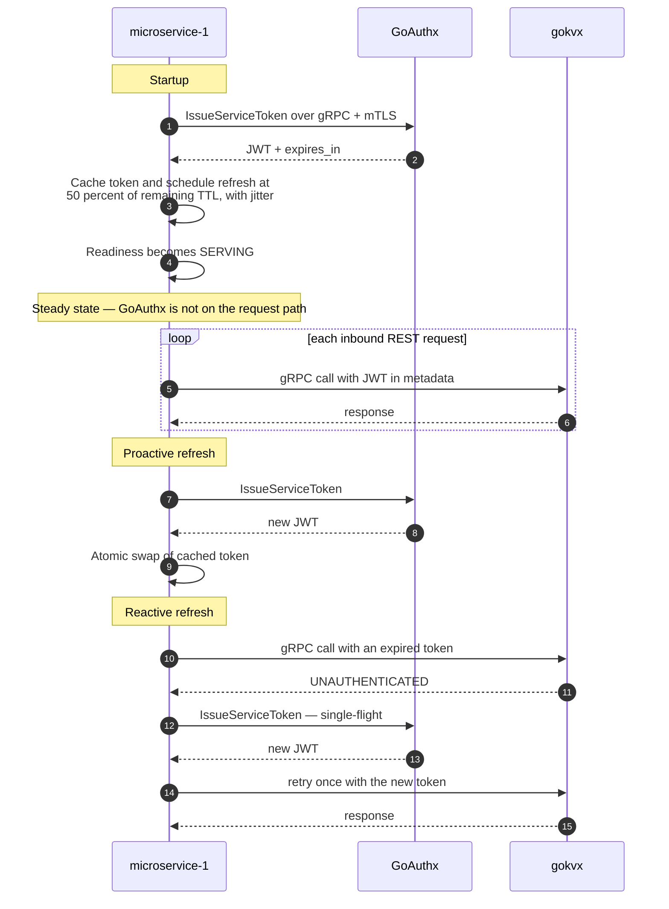

| ID | Phase | Priority | Requirement | Status |
|---|---|---|---|---|
| `MS1-SEC-001` | P1 | MUST | On startup the service **MUST** obtain a service JWT from GoAuthx over gRPC with mTLS using its own service-account credentials. | SPEC |
| `MS1-SEC-002` | P1 | MUST | The token **MUST** be held in memory only. It **MUST NOT** be written to disk, logged, included in traces or metrics, or returned in any response. | SPEC |
| `MS1-SEC-003` | P1 | MUST | The service **MUST** refresh proactively at a configurable fraction of the token's lifetime, defaulting to 50%, with randomised jitter of at least ±10% to prevent synchronised refresh storms across replicas. | SPEC |
| `MS1-SEC-004` | P1 | MUST | The service **MUST** additionally refresh reactively on receiving `UNAUTHENTICATED` from `gokvx`, and **MUST** retry the original request exactly once with the new token. It **MUST NOT** retry more than once, and **MUST NOT** retry on `PERMISSION_DENIED`, which indicates a scope misconfiguration rather than an expired credential. | SPEC |
| `MS1-SEC-005` | P1 | MUST | Concurrent refresh attempts **MUST** be collapsed into a single in-flight request using a single-flight primitive. A burst of failing requests **MUST NOT** produce a burst of token requests to GoAuthx. | SPEC |
| `MS1-SEC-006` | P1 | MUST | Refresh failures **MUST** be retried with exponential backoff and full jitter, bounded by a configurable maximum interval. A circuit breaker **MUST** prevent sustained hammering of GoAuthx during an outage. | SPEC |
| `MS1-SEC-007` | P1 | MUST | While a valid cached token exists, a refresh failure **MUST NOT** affect request serving. The service **MUST** become `NOT_SERVING` on readiness only once the cached token is expired or absent. | SPEC |
| `MS1-SEC-008` | P1 | MUST | The service **MUST NOT** call GoAuthx as part of handling an inbound REST request under any circumstance. | SPEC |
| `MS1-SEC-009` | P1 | MUST | Token acquisition and refresh **MUST** be implemented behind a `TokenSource` interface that can be substituted in unit tests with a fake clock, so that refresh timing, jitter, single-flight, and backoff are testable without real time passing. | SPEC |
| `MS1-SEC-010` | P1 | MUST | The service account's credentials **MUST** be supplied by file path or environment variable, mounted as a Kubernetes Secret, and **MUST NOT** appear in the container image or in version control. | SPEC |

### 14.3 REST API

Base path: `/api/v1`.

| Method | Path | gokvx RPC | Required scope | Success |
|---|---|---|---|---|
| `PUT` | `/api/v1/kv/{key...}` | `Put` | `kv:write` | `200 OK` on update, `201 Created` on create |
| `POST` | `/api/v1/kv/{key...}` | `Put` | `kv:write` | Accepted as an alias for `PUT` |
| `GET` | `/api/v1/kv/{key...}` | `Get` | `kv:read` | `200 OK` |
| `DELETE` | `/api/v1/kv/{key...}` | `Delete` | `kv:write` | `204 No Content` |
| `GET` | `/api/v1/kv?prefix=&limit=&page_token=&keys_only=` | `List` | `kv:read` | `200 OK` |
| `GET` | `/healthz` | — | — | Liveness |
| `GET` | `/readyz` | — | — | Readiness |
| `GET` | `/metrics` | — | — | Prometheus exposition |

| ID | Phase | Priority | Requirement | Status |
|---|---|---|---|---|
| `MS1-API-001` | P1 | MUST | The key **MUST** be taken from the remainder of the path after `/api/v1/kv/`, permitting slashes within the key. A `key` query parameter carrying a base64url-encoded key **MUST** additionally be supported for keys containing bytes that cannot appear in a path segment, and the two forms **MUST** be mutually exclusive. | SPEC |
| `MS1-API-002` | P1 | MUST | Keys and values **MUST** be validated against configurable limits before any RPC is issued, rejecting oversized input with `400` and a structured error body. | SPEC |
| `MS1-API-003` | P1 | MUST | `PUT` **MUST** accept `application/octet-stream` as a raw value and `application/json` as `{"value": "<base64>"}`. The content type **MUST** determine the interpretation, and an unsupported type **MUST** yield `415`. | SPEC |
| `MS1-API-004` | P1 | MUST | `GET` **MUST** return the value together with `create_revision`, `mod_revision`, `version`, and the cluster revision. It **MUST** set an `ETag` derived from `mod_revision` and **MUST** honour `If-None-Match` with `304`. | SPEC |
| `MS1-API-005` | P1 | MUST | `PUT` **MUST** honour `If-Match` by translating it into a `CompareAndSwap` on `mod_revision`, returning `412 Precondition Failed` when the comparison fails. `If-None-Match: *` **MUST** translate into create-if-absent. | SPEC |
| `MS1-API-006` | P1 | MUST | `GET /api/v1/kv` **MUST** require a non-empty `prefix`, **MUST** default `limit` to 100 and cap it at a configurable maximum, and **MUST** return the opaque `next_page_token` returned by `gokvx` unmodified. | SPEC |
| `MS1-API-007` | P1 | MUST | All error responses **MUST** use a single structured JSON shape containing `code`, `message`, `request_id`, and optionally `details`. Raw gRPC error strings and internal messages **MUST NOT** be surfaced. | SPEC |
| `MS1-API-008` | P1 | MUST | Status mapping **MUST** follow [Appendix B](#appendix-b--error-model-and-status-mapping) exactly, and **MUST** be covered by a table-driven unit test enumerating every gRPC code. | SPEC |
| `MS1-API-009` | P1 | MUST | An OpenAPI 3.1 specification **MUST** be committed to `api/openapi.yaml`, **MUST** be served at `/api/v1/openapi.yaml`, and **MUST** be validated in CI against the implemented routes. | SPEC |
| `MS1-API-010` | P1 | MUST | Every response **MUST** carry an `X-Request-Id` header, echoing an inbound value when present and generating one otherwise. | SPEC |
| `MS1-API-011` | P1 | SHOULD | The service **SHOULD** serve a small static landing page at `/` documenting the API with runnable `curl` examples and a link to the OpenAPI document. | SPEC |
| `MS1-API-012` | P1 | MUST | The HTTP server **MUST** set read, write, idle, and header-read timeouts, and **MUST** enforce a maximum request body size. | SPEC |

### 14.4 gokvx client integration

| ID | Phase | Priority | Requirement | Status |
|---|---|---|---|---|
| `MS1-API-020` | P1 | MUST | The service **MUST** maintain a long-lived gRPC client to `gokvx` over mTLS, built from the shared `.proto` contract consumed as a versioned module. The `.proto` **MUST NOT** be copied into this repository by hand. | SPEC |
| `MS1-API-021` | P1 | MUST | The client **MUST** use client-side round-robin load balancing over DNS resolution of the `gokvx` headless service, so that all endpoints are used and endpoint changes are picked up without a restart. | SPEC |
| `MS1-API-022` | P1 | MUST | The client **MUST** configure keepalive parameters compatible with the server's enforcement policy, and a connection backoff policy with jitter. | SPEC |
| `MS1-API-023` | P1 | MUST | A per-request deadline **MUST** be derived from the inbound HTTP request context and a configurable ceiling, and **MUST** be propagated to the RPC. | SPEC |
| `MS1-API-024` | P1 | MUST | Retries **MUST** be attempted only for `UNAVAILABLE` and `DEADLINE_EXCEEDED`, only for idempotent operations (`Get`, `List`, `Delete`), with a bounded attempt count and exponential backoff with full jitter. `Put` **MUST NOT** be retried automatically unless the request carried an `If-Match` precondition making it idempotent. | SPEC |
| `MS1-API-025` | P1 | MUST | The token **MUST** be attached via a gRPC `PerRPCCredentials` implementation reading from the token cache at call time, not captured once at client construction. | SPEC |
| `MS1-API-026` | P1 | SHOULD | The client **SHOULD** apply a circuit breaker per endpoint so that a persistently failing `gokvx` node is shed quickly rather than consuming request deadlines. | SPEC |

### 14.5 Observability

| ID | Phase | Priority | Requirement | Status |
|---|---|---|---|---|
| `MS1-OBS-001` | P1 | MUST | OpenTelemetry tracing **MUST** be integrated. Trace context **MUST** be extracted from the inbound HTTP request and injected into the outbound gRPC call, producing one connected trace spanning the REST entry point, token cache lookup, and the `gokvx` operation. | SPEC |
| `MS1-OBS-002` | P1 | MUST | Token acquisition and refresh **MUST** be traced as their own spans, linked to the triggering request when reactive. | SPEC |
| `MS1-OBS-003` | P1 | MUST | Prometheus metrics **MUST** include request count, latency histogram, and error count labelled by route template and status class; the outbound gRPC equivalents labelled by method and code; token age, time until expiry, refresh count, and refresh failure count. | SPEC |
| `MS1-OBS-004` | P1 | MUST | Route labels **MUST** use the route template, never the resolved path, to prevent unbounded label cardinality from user-supplied keys. | SPEC |
| `MS1-OBS-005` | P1 | MUST | Logs **MUST** be structured JSON including `trace_id`, `span_id`, `request_id`, route template, status, and duration. Keys **MUST NOT** be logged at `INFO` or above in the public deployment. | SPEC |
| `MS1-OBS-006` | P1 | MUST | `/healthz` **MUST** report process liveness only. `/readyz` **MUST** report `200` only when the gRPC channel to `gokvx` is in a usable state and a non-expired token is cached, and `503` with a machine-readable body naming the failing dependency otherwise. | SPEC |
| `MS1-OBS-007` | P1 | MUST | `/readyz` **MUST NOT** issue a write to `gokvx`. It **MAY** consult the gRPC health service or the cached channel state. | SPEC |

---

## 15. GoAuthx — Required Contract

GoAuthx is developed separately. This section defines only what `gokvx` and `microservice-1` require of it, so that the two services in scope can be built and tested against a contract rather than an implementation.

| ID | Priority | Expectation | Status |
|---|---|---|---|
| `AUX-001` | MUST | A `service_accounts` concept exists, distinct from human users, with machine credentials and independently assignable scopes. | External |
| `AUX-002` | MUST | A gRPC interface exposes `IssueServiceToken` implementing a client-credentials-style flow, served over mTLS alongside the existing REST API. | External |
| `AUX-003` | MUST | Issued tokens are RS256-signed JWTs containing at minimum `iss`, `sub`, `aud`, `exp`, `nbf`, `iat`, `jti`, `scope`, and a `kid` in the header. | External |
| `AUX-004` | MUST | A JWKS document is published at a stable HTTPS URL conforming to RFC 7517, and key rotation publishes the new key before it is used to sign, retaining the previous key for at least the maximum token lifetime. | External |
| `AUX-005` | MUST | Token issuance for service accounts is recorded in the existing `audit_events` mechanism. | External |
| `AUX-006` | MUST | Existing tenant, user, and RBAC REST domains are unchanged. | External |
| `AUX-007` | SHOULD | Token lifetime is configurable per service account, with a documented default suitable for the refresh strategy in §14.2. | External |

| ID | Phase | Priority | Requirement | Status |
|---|---|---|---|---|
| `MS1-SEC-020` | P1 | MUST | The development and test stacks **MUST** be able to run against a contract-conformant **stub issuer** that signs RS256 tokens and serves a JWKS document, so that the two in-scope services can be developed and CI-tested independently of GoAuthx availability. | SPEC |
| `MS1-SEC-021` | P1 | MUST | A contract test suite **MUST** exist that runs identically against the stub and against a real GoAuthx instance, asserting the claims and behaviours in `AUX-001`–`AUX-007`. | SPEC |
| `KV-SEC-050` | P1 | MUST | `gokvx` integration tests **MUST** use the stub issuer, demonstrating by construction that `gokvx` is provider-agnostic (§5.2, C-1). | SPEC |

---

## 16. Deployment

### 16.1 Parity principle

> **DEP-000** `P1` **MUST** — Every capability delivered for Docker Compose **MUST** have an equivalent Kubernetes implementation, and the identical end-to-end test binary **MUST** run against both. A feature is not complete until both targets are covered.

### 16.2 Container images

| ID | Phase | Priority | Requirement | Status |
|---|---|---|---|---|
| `DEP-001` | P1 | MUST | Images **MUST** be built with a multi-stage Dockerfile producing a static binary on a `distroless` or `scratch` base, containing no shell or package manager. | SPEC |
| `DEP-002` | P1 | MUST | Images **MUST** be built for `linux/amd64` and `linux/arm64`. | SPEC |
| `DEP-003` | P1 | MUST | Builds **MUST** be reproducible: pinned base image digests, `-trimpath`, and version metadata injected via `-ldflags`. | SPEC |
| `DEP-004` | P1 | MUST | Images **MUST** be tagged with the semantic version and the git commit SHA. The `latest` tag **MUST NOT** be used by any deployment manifest. | SPEC |
| `DEP-005` | P1 | MUST | Images **MUST** be published to Google Artifact Registry and **MUST** be signed with `cosign`; a SBOM in SPDX or CycloneDX format **MUST** be attached as an attestation. | SPEC |

### 16.3 Docker Compose

| ID | Phase | Priority | Requirement | Status |
|---|---|---|---|---|
| `DEP-010` | P1 | MUST | `docker compose up` **MUST** bring up the complete stack in one command: `gokvx` (single node at P1, three nodes from P2), the identity provider or stub, `microservice-1`, an OTLP collector, Prometheus, and Grafana with the dashboard pre-provisioned. | SPEC |
| `DEP-011` | P1 | MUST | A `make certs` target **MUST** generate a development CA and per-service leaf certificates with correct SANs, so that the mTLS path is exercised locally exactly as in production. | SPEC |
| `DEP-012` | P1 | MUST | Health checks and `depends_on` conditions **MUST** be declared so that services start in a valid order and the stack reaches readiness without manual retries. | SPEC |
| `DEP-013` | P2 | MUST | The Compose stack **MUST** support killing and restarting an individual `gokvx` node to demonstrate failover, with named volumes so that a restarted node recovers its data directory. | SPEC |
| `DEP-014` | P1 | MUST | Development-mode certificates and credentials **MUST** be clearly marked as insecure and **MUST NOT** be reused in any deployed environment. | SPEC |

### 16.4 Kubernetes topology

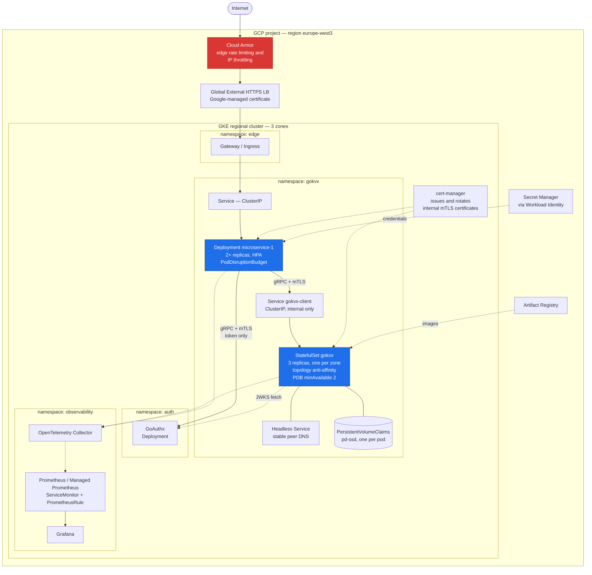

| ID | Phase | Priority | Requirement | Status |
|---|---|---|---|---|
| `DEP-020` | P1 | MUST | `gokvx` **MUST** be deployed as a `StatefulSet` with a headless `Service` providing stable per-pod DNS, and a `volumeClaimTemplate` providing per-pod persistent storage. | SPEC |
| `DEP-021` | P1 | MUST | The `gokvx` client `Service` **MUST** be `ClusterIP` and **MUST NOT** be exposed outside the cluster in any environment. | SPEC |
| `DEP-022` | P1 | MUST | Readiness **MUST** use a gRPC probe against `gokvx.readiness`; liveness **MUST** use a gRPC probe against the default service name; a `startupProbe` **MUST** allow sufficient time for engine open and log replay on large data directories. | SPEC |
| `DEP-023` | P2 | MUST | Liveness **MUST NOT** be tied to quorum, leadership, or peer reachability. A node that has lost quorum **MUST NOT** be restarted by the kubelet. | SPEC |
| `DEP-024` | P2 | MUST | A `PodDisruptionBudget` **MUST** be defined guaranteeing that a voluntary disruption cannot reduce a group below quorum. For a 3-replica group, `minAvailable` **MUST** be `2`. | SPEC |
| `DEP-025` | P2 | MUST | Pod anti-affinity **MUST** spread replicas across zones using `topology.kubernetes.io/zone`, with `requiredDuringSchedulingIgnoredDuringExecution` for node-level spreading. | SPEC |
| `DEP-026` | P2 | MUST | The `StatefulSet` update strategy **MUST** be `RollingUpdate` with `podManagementPolicy: OrderedReady`, and a `preStop` hook **MUST** trigger leadership transfer before termination. `terminationGracePeriodSeconds` **MUST** exceed the configured graceful-shutdown deadline. | SPEC |
| `DEP-027` | P1 | MUST | All workloads **MUST** declare CPU and memory requests and limits. `gokvx` memory limits **MUST** be set in coordination with `GOMEMLIMIT` (`KV-CFG-013`). | SPEC |
| `DEP-028` | P1 | MUST | `NetworkPolicy` resources **MUST** restrict ingress to `gokvx` to the `microservice-1` and `gokvx` peer pods only, and **MUST** deny all other ingress by default in the application namespace. | SPEC |
| `DEP-029` | P1 | MUST | Pod security **MUST** satisfy the `restricted` Pod Security Standard: non-root, `readOnlyRootFilesystem`, `allowPrivilegeEscalation: false`, seccomp `RuntimeDefault`, all capabilities dropped. | SPEC |
| `DEP-030` | P1 | MUST | Internal mTLS certificates **MUST** be issued and rotated by `cert-manager`, with SANs matching the headless-service pod DNS names, and **MUST** be consumed by the node's hot-reload mechanism (`KV-SEC-005`) without a pod restart. | SPEC |
| `DEP-031` | P1 | MUST | `microservice-1` **MUST** be deployed as a `Deployment` with at least two replicas, a `PodDisruptionBudget`, a rolling update strategy with `maxUnavailable: 0`, and an `HorizontalPodAutoscaler`. | SPEC |
| `DEP-032` | P1 | MUST | Metrics **MUST** be collected via a `ServiceMonitor` or `PodMonitor`, and alerting rules **MUST** be delivered as a `PrometheusRule`. | SPEC |

### 16.5 Helm

| ID | Phase | Priority | Requirement | Status |
|---|---|---|---|---|
| `DEP-040` | P1 | MUST | Deployment **MUST** be packaged as Helm charts under `deploy/helm/` — one per service plus an umbrella chart bringing up the full stack. | SPEC |
| `DEP-041` | P1 | MUST | Each chart **MUST** ship a JSON Schema (`values.schema.json`) validating its values, and **MUST** fail rendering with a clear message on invalid input. | SPEC |
| `DEP-042` | P1 | MUST | Separate values files **MUST** be provided for `dev`, `ci`, and `prod`, and the `prod` file **MUST** enforce authentication enabled, non-`latest` image tags, resource limits set, and replica counts consistent with the PDB. | SPEC |
| `DEP-043` | P1 | MUST | Charts **MUST** be linted and rendered in CI, and the rendered manifests **MUST** be validated against the Kubernetes API schema and scanned for policy violations. | SPEC |
| `DEP-044` | P1 | SHOULD | Charts **SHOULD** be published as OCI artefacts to Artifact Registry alongside the images. | SPEC |

### 16.6 GKE and infrastructure as code

| ID | Phase | Priority | Requirement | Status |
|---|---|---|---|---|
| `DEP-050` | P1 | MUST | All GCP infrastructure **MUST** be declared in Terraform under `deploy/terraform/` with remote state in a GCS backend and state locking. No resource may be created by hand in the console. | SPEC |
| `DEP-051` | P1 | MUST | The cluster **MUST** be a **regional** GKE cluster in `europe-west3` (Frankfurt), providing a highly available control plane and nodes across three zones. | SPEC |
| `DEP-052` | P1 | MUST | Workloads **MUST** authenticate to GCP services using **Workload Identity**. Service-account JSON keys **MUST NOT** be created or mounted. | SPEC |
| `DEP-053` | P1 | MUST | CI **MUST** authenticate to GCP using **Workload Identity Federation** from GitHub Actions. No long-lived cloud credential may be stored as a repository secret. | SPEC |
| `DEP-054` | P1 | MUST | Application secrets **MUST** be stored in Secret Manager and projected into pods via the Secret Manager CSI driver or an External Secrets operator. Secrets **MUST NOT** be committed, even encrypted, without an explicit documented key-management process. | SPEC |
| `DEP-055` | P1 | MUST | The cluster **MUST** be private, with authorized networks restricting control-plane access, and **MUST** have Shielded Nodes enabled. | SPEC |
| `DEP-056` | P1 | MUST | Deployment **MUST** be automated: a tagged release triggers image build, signing, chart publication, and a deployment to the demonstration environment, followed by an automated smoke suite that gates the rollout. | SPEC |
| `DEP-057` | P1 | MUST | A documented rollback procedure **MUST** exist and **MUST** be exercised at least once per phase, with the result recorded in the runbook. | SPEC |
| `DEP-058` | P1 | MUST | A GCP budget with alert thresholds **MUST** be declared in Terraform, and autoscaling maxima **MUST** be capped so that a traffic spike cannot produce unbounded spend. | SPEC |
| `DEP-059` | P1 | SHOULD | The trade-off between GKE Autopilot and Standard **SHOULD** be recorded in [ADR-0007](#21-architecture-decision-records), including the implications for `StatefulSet` storage classes, `DaemonSet` usage, and cost. | SPEC |
| `DEP-060` | P1 | SHOULD | A `kind`-based local Kubernetes bring-up (`make kind-up`) **SHOULD** deploy the same charts, so that Kubernetes behaviour is testable without cloud spend. | SPEC |

---

## 17. Public Demonstration Environment

The system is deployed publicly so that the API can be exercised by anyone. An openly writable datastore is an abuse and cost liability, and the controls below are release-blocking rather than optional.

### 17.1 Exposure surface

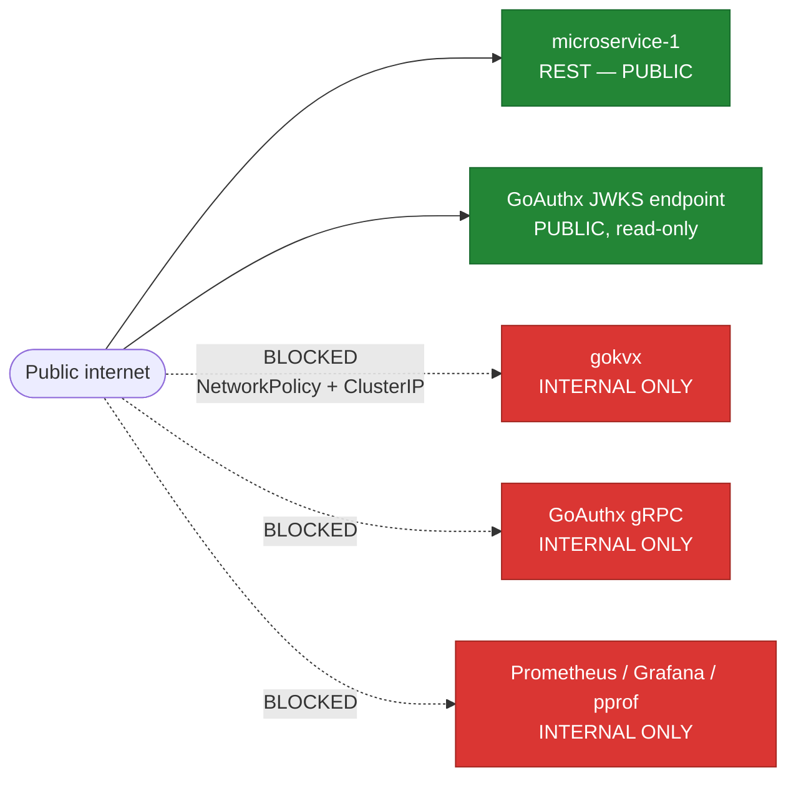

| ID | Phase | Priority | Requirement | Status |
|---|---|---|---|---|
| `DEM-001` | P1 | MUST | Only the `microservice-1` REST API and the issuer's JWKS endpoint **MUST** be reachable from the public internet. `gokvx`, the identity provider's gRPC interface, metrics endpoints, `pprof`, and Grafana **MUST NOT** be publicly reachable. | SPEC |
| `DEM-002` | P1 | MUST | Public access **MUST** be TLS-only, with HTTP redirected to HTTPS and HSTS enabled. | SPEC |

### 17.2 Abuse and cost controls

| ID | Phase | Priority | Requirement | Status |
|---|---|---|---|---|
| `DEM-010` | P1 | MUST | Edge rate limiting **MUST** be applied per client IP, with a documented steady-state rate and burst, returning `429` with a `Retry-After` header. Application-level rate limiting **MUST** also be present so that the service is protected independently of the edge. | SPEC |
| `DEM-011` | P1 | MUST | In the public environment all writes **MUST** be confined to an enforced key namespace. A write outside the demonstration prefix **MUST** be rejected with `403`. | SPEC |
| `DEM-012` | P1 | MUST | Public-environment limits **MUST** be tightened relative to defaults: maximum value size 64 KiB, maximum key length 256 bytes, maximum keys per prefix, and a global store size cap. | SPEC |
| `DEM-013` | P1 | MUST | All demonstration data **MUST** be ephemeral. A scheduled job **MUST** purge the demonstration namespace on a documented interval, and the retention period **MUST** be stated in the API landing page and in the OpenAPI description. From Phase 4 this **MAY** instead be implemented with leases. | SPEC |
| `DEM-014` | P1 | MUST | A documented, authenticated procedure **MUST** exist for immediate removal of specific content on request. | SPEC |
| `DEM-015` | P1 | MUST | The landing page **MUST** state plainly that the endpoint is a public demonstration, that submitted data is world-readable, and that no confidential or personal data should be submitted. | SPEC |
| `DEM-016` | P1 | MUST | Autoscaling maxima, node pool maxima, and disk sizes **MUST** be capped, and budget alerts **MUST** be configured (`DEP-058`). | SPEC |
| `DEM-017` | P1 | SHOULD | The public deployment **SHOULD** publish a status indicator and **SHOULD** be monitored by an external uptime check that alerts the maintainer on failure. | SPEC |

### 17.3 Caller authentication is out of scope

| ID | Phase | Priority | Requirement | Status |
|---|---|---|---|---|
| `DEM-020` | P1 | MUST | The absence of end-user authentication on the `microservice-1` REST API **MUST** be documented explicitly as a deliberate scope decision (§2.2, NG-5), together with the compensating controls in §17.2 and a note that a production deployment would terminate caller authentication at the gateway. An undocumented open endpoint and a documented, deliberately open demonstration endpoint are different engineering artefacts. | SPEC |

### 17.4 Legal and privacy

| ID | Phase | Priority | Requirement | Status |
|---|---|---|---|---|
| `DEM-030` | P1 | MUST | The public site **MUST** provide an imprint (*Impressum*) and a privacy notice covering the processing of IP addresses in access logs, the retention period, and the hosting region. | SPEC |
| `DEM-031` | P1 | MUST | Access logs containing IP addresses **MUST** have a defined, short retention period, and the region **MUST** be within the EU (§`DEP-051`). | SPEC |

> The maintainer is responsible for confirming the applicable legal requirements for the jurisdiction in which the site is published. This document states the engineering obligation, not legal advice.

---

## 18. Quality Assurance and Verification

### 18.1 Test pyramid

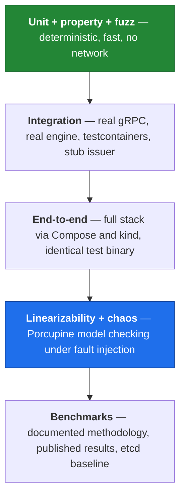

### 18.2 Unit and property testing

| ID | Phase | Priority | Requirement | Status |
|---|---|---|---|---|
| `QA-001` | P1 | MUST | Unit tests **MUST** run with `-race` in CI. A data race **MUST** fail the build. | SPEC |
| `QA-002` | P1 | MUST | Statement coverage (`go test -covermode=atomic`) of non-generated code **MUST** be ≥ 75%; statement coverage of the `consensus`, `storage`, `mvcc`, and `auth` packages **MUST** be ≥ 85%. (Go's toolchain measures statement, not branch, coverage.) Coverage **MUST** be enforced in CI and reported on pull requests. | SPEC |
| `QA-003` | P1 | MUST | Time-dependent behaviour — token refresh, lease expiry, election timing, backoff — **MUST** be tested with an injected fake clock. Tests **MUST NOT** rely on `time.Sleep` for correctness. | SPEC |
| `QA-004` | P1 | MUST | Property-based tests **MUST** cover the MVCC store, asserting invariants such as: `mod_revision` is non-decreasing per key; a read at revision *R* is unaffected by writes at revisions greater than *R*; and a key's `version` is consistent with its write history. | SPEC |
| `QA-005` | P1 | MUST | Fuzz tests **MUST** cover key encoding and decoding, page-token encoding and decoding, and JWT parsing. Any crash found **MUST** be added to the seed corpus. | SPEC |
| `QA-006` | P1 | MUST | The slot function **MUST** have golden tests fixing its output for a committed set of keys, so that a change to the hash — which would silently misroute all existing data — is impossible to merge accidentally. | DONE |
| `QA-007` | P1 | MUST | Table-driven tests **MUST** cover the complete authorization matrix: every method against every scope combination, asserting allow or deny. | SPEC |
| `QA-008` | P1 | MUST | The JWT verifier **MUST** be tested against a corpus of hostile tokens: `alg: none`, algorithm confusion, missing or unknown `kid`, expired, not-yet-valid, wrong issuer, wrong audience, tampered payload, and oversized tokens. | SPEC |

### 18.3 Integration and end-to-end testing

| ID | Phase | Priority | Requirement | Status |
|---|---|---|---|---|
| `QA-010` | P1 | MUST | Integration tests **MUST** exercise the real gRPC server, the real storage engine, real mTLS, and the stub issuer — no in-process shortcuts for these layers. | SPEC |
| `QA-011` | P1 | MUST | Multi-node integration tests **MUST** be runnable via `testcontainers-go` and via Docker Compose, and **MUST** be deterministic enough to run on every pull request. | SPEC |
| `QA-012` | P1 | MUST | The end-to-end suite **MUST** be a single binary parameterised by target, executed against both Compose and `kind` in CI. Divergent test code between targets **MUST NOT** exist. | SPEC |
| `QA-013` | P1 | MUST | An end-to-end scenario **MUST** cover the complete happy path: `microservice-1` starts, obtains a token, and serves `PUT`, `GET`, `LIST`, and `DELETE` through to `gokvx`, with assertions on trace continuity across all three services. | SPEC |
| `QA-014` | P1 | MUST | Negative end-to-end scenarios **MUST** cover: expired token triggering reactive refresh and a successful retry; insufficient scope on `microservice-1`'s service account producing `502` (Appendix B.2), and a write outside the demonstration namespace producing `403` (`DEM-011`); and identity-provider unavailability leaving already-authenticated request serving unaffected. | SPEC |
| `QA-015` | P2 | MUST | A failover scenario **MUST** kill the leader under sustained load and assert that write availability recovers within the bound in `KV-CON-021` and that no acknowledged write is lost. | SPEC |
| `QA-016` | P1 | MUST | Tests **MUST** be hermetic: no reliance on external network access, wall-clock coincidence, or execution order. Flaky tests **MUST** be quarantined and fixed, never retried into passing. | SPEC |

### 18.4 Linearizability and fault injection

This is the primary evidence that the consistency claims in this document are true rather than aspirational.

| ID | Phase | Priority | Requirement | Status |
|---|---|---|---|---|
| `QA-020` | P2 | MUST | A verification harness **MUST** record a history of concurrent client operations with invocation and completion timestamps and check it for linearizability using `anishathalye/porcupine` against a model of the register semantics. | SPEC |
| `QA-021` | P2 | MUST | Operations whose outcome is unknown — timeouts, connection resets — **MUST** be recorded as indeterminate rather than discarded, since a dropped unknown operation can mask a genuine violation. | SPEC |
| `QA-022` | P2 | MUST | The harness **MUST** run under the fault scenarios: leader kill (`SIGKILL`), graceful leader stop, network partition isolating the leader, symmetric partition of a minority, process pause (`SIGSTOP`/`SIGCONT`) simulating a long GC pause, clock skew between nodes, and packet loss and latency injection. | SPEC |
| `QA-023` | P2 | MUST | Any detected violation **MUST** fail the build and **MUST** emit the offending history and a visualisation for post-mortem analysis. | SPEC |
| `QA-024` | P2 | MUST | The harness **MUST** run on every pull request with a short duration and on a scheduled nightly job with a long duration and a documented number of randomised seeds. Seeds **MUST** be logged so that a failure is reproducible. | SPEC |
| `QA-025` | P2 | MUST | A dedicated test **MUST** assert that a `STALE` read never returns a revision below a previously observed revision for the same client session, verifying monotonic-read behaviour within a session. | SPEC |
| `QA-026` | P4 | MUST | The harness **MUST** additionally run across a live slot migration (`KV-CON-053`) and across membership changes. | SPEC |

### 18.5 Benchmarking

| ID | Phase | Priority | Requirement | Status |
|---|---|---|---|---|
| `QA-030` | P1 | MUST | A benchmark suite **MUST** measure throughput and latency for `Get`, `Put`, mixed read/write ratios, `List` over varying result sizes, and `Watch` fan-out, across a documented matrix of concurrency levels and value sizes. | SPEC |
| `QA-031` | P1 | MUST | Results **MUST** report p50, p95, p99, and p99.9 latency and sustained throughput. A mean-only result **MUST NOT** be published. | SPEC |
| `QA-032` | P1 | MUST | Published results **MUST** state the methodology in full: machine type, vCPU, memory, disk type and IOPS, network, replication factor, fsync policy, client concurrency, warm-up duration, measurement duration, and the exact command used. A result without its methodology is not a result. | SPEC |
| `QA-033` | P2 | SHOULD | The suite **SHOULD** include a comparison against `etcd` under an identical workload and hardware profile, with any configuration differences disclosed. The purpose is calibration, not a marketing claim. | SPEC |
| `QA-034` | P1 | MUST | The load generator **MUST** measure latency at the client using a coordinated-omission-aware approach: request start times are scheduled against an open-loop target rate, not derived from the completion of the preceding request. | SPEC |
| `QA-035` | P1 | MUST | Results **MUST** be committed to `docs/benchmarks/` with the raw data, and the headline numbers **MUST** be summarised in the README with a link to the methodology. | SPEC |
| `QA-036` | P2 | SHOULD | A micro-benchmark regression check **SHOULD** run in CI using `benchstat` against the previous commit, flagging significant regressions without hard-failing on noisy hardware. | SPEC |

---

## 19. CI/CD and Software Supply Chain

| ID | Phase | Priority | Requirement | Status |
|---|---|---|---|---|
| `QA-040` | P1 | MUST | CI **MUST** run on GitHub Actions and **MUST** execute, on every pull request: `gofmt` check, `go vet`, `golangci-lint`, `buf lint`, `buf breaking`, unit tests with race detection and coverage, integration tests, `kind` end-to-end tests, Helm lint and template validation, and — from Phase 2, once the harness exists (`QA-020`) — a short linearizability run. | SPEC |
| `QA-041` | P1 | MUST | `govulncheck` **MUST** run on every pull request and on a daily schedule, failing on a known-exploitable vulnerability in a reachable code path. | SPEC |
| `QA-042` | P1 | MUST | Container images **MUST** be scanned with `trivy` or an equivalent, failing on `HIGH` or `CRITICAL` findings with a documented, time-bounded exception process. | SPEC |
| `QA-043` | P1 | MUST | A secret scanner **MUST** run on every pull request and on the full history. | SPEC |
| `QA-044` | P1 | MUST | Infrastructure code **MUST** be validated with `terraform validate` and `tflint`, and scanned with a policy tool such as `tfsec` or `checkov`. Kubernetes manifests **MUST** be scanned with `kubeconform` and a policy scanner. | SPEC |
| `QA-045` | P1 | MUST | Releases **MUST** follow Semantic Versioning, **MUST** be driven by Conventional Commits, and **MUST** produce a generated changelog. | SPEC |
| `QA-046` | P1 | MUST | The default branch **MUST** be protected: required status checks, required review, linear history, and no force-push. | SPEC |
| `QA-047` | P1 | MUST | Dependency updates **MUST** be automated with Renovate or Dependabot, with grouped minor updates and separate security updates. | SPEC |
| `QA-048` | P1 | MUST | A `Makefile` **MUST** be the single entry point for every developer task: `make build test lint proto certs up down e2e bench kind-up deploy`. Each target except `deploy` **MUST** work from a clean checkout with only Docker and Go installed; `deploy` additionally requires Terraform, `gcloud`, and Helm, and **MUST** fail with a clear message naming any missing tool. | SPEC |
| `QA-049` | P1 | SHOULD | Build provenance **SHOULD** be generated in accordance with SLSA build level 2 or higher and attached to released images. | SPEC |
| `QA-050` | P1 | SHOULD | A `CONTRIBUTING.md`, `SECURITY.md` with a disclosure policy, `CODE_OF_CONDUCT.md`, and an OSI-approved `LICENSE` **SHOULD** be present. | SPEC |

---

## 20. Non-Functional Targets

Targets apply to a three-node `gokvx` group on `e2-standard-4`-class nodes with SSD persistent disks within one GCP region, with `fsync: always`, values of 1 KiB, and authentication enabled. They are engineering targets to be validated by §18.5, not guarantees.

| ID | Phase | Metric | Target |
|---|---|---|---|
| `NFR-001` | P1 | Single-node `Get` p99 latency, warm cache | < 2 ms |
| `NFR-002` | P2 | Replicated `Put` p99 latency, 3 replicas | < 25 ms |
| `NFR-003` | P2 | Linearizable `Get` p99 latency via ReadIndex | < 10 ms |
| `NFR-004` | P2 | Sustained write throughput, 3 replicas, 64 concurrent clients | ≥ 5,000 ops/s |
| `NFR-005` | P1 | Sustained read throughput, serializable, 64 concurrent clients | ≥ 40,000 ops/s |
| `NFR-006` | P2 | Time to restore write availability after leader `SIGKILL` (median) | < 3 s |
| `NFR-007` | P2 | Time to restore write availability after leader `SIGKILL` (p99) | < 10 s |
| `NFR-008` | P1 | Process start to readiness with an empty data directory | < 5 s |
| `NFR-009` | P1 | Authentication and authorization overhead per request, cache warm | < 200 µs |
| `NFR-010` | P1 | `microservice-1` added latency over the underlying `gokvx` call, p99 | < 5 ms |
| `NFR-011` | P2 | Replication lag under steady load, p99 | < 100 ms |
| `NFR-012` | P1 | Idle memory footprint per `gokvx` node, empty store | < 128 MiB |

| ID | Phase | Priority | Requirement | Status |
|---|---|---|---|---|
| `NFR-020` | P1 | MUST | Each target in the table above **MUST** be measured by the benchmark suite and the measured value published alongside the target. Where a target is not met, the gap **MUST** be documented with an analysis rather than the target being silently revised. | SPEC |

---

## 21. Architecture Decision Records

Decisions are recorded as ADRs in `docs/adr/` using the MADR template. An ADR is immutable once accepted; a reversal is a new ADR superseding it. The following are required.

| ADR | Title | Decision summary |
|---|---|---|
| `ADR-0001` | CAP positioning | `gokvx` is a CP system. Under a network partition, the minority side rejects writes and linearizable reads rather than serving potentially stale or divergent data. The stale-read mode is the explicit, opt-in escape hatch, scoped to reads only and detectable by the client via the returned revision. |
| `ADR-0002` | Raft library rather than a bespoke implementation | `etcd-io/raft` is adopted. It is a widely deployed, well-tested implementation of the algorithm with explicit `Ready`-loop control, leaving storage, transport, and the state machine — where this project's engineering value lies — fully under our control. A bespoke implementation would add substantial correctness risk for no architectural benefit. |
| `ADR-0003` | Fixed slot space rather than a consistent hash ring | A fixed 16384-slot space decouples key placement from topology, making the key-to-slot mapping permanent and reducing elasticity to the tractable problem of moving whole slots. Rationale in §10.3. |
| `ADR-0004` | MVCC revision model | A monotonic per-group revision with tombstones and compaction is adopted to give `Watch` a gapless resumable position, `CompareAndSwap` a cheap comparison target, and paginated scans a consistent snapshot. The cost is write amplification and a compaction obligation. |
| `ADR-0005` | Pebble as the storage engine | Pure Go, no cgo, production-proven in CockroachDB, with an LSM design suited to this write pattern. BadgerDB and BoltDB are considered and rejected, with reasons recorded. |
| `ADR-0006` | mTLS and JWT as complementary controls | Rationale in §11.1: certificate identity answers "which workload", token identity answers "which principal, with what authority". |
| `ADR-0007` | GKE Autopilot versus Standard | Records the trade-off across `StatefulSet` storage classes, node-level control, `DaemonSet` support, operational burden, and cost for this workload. |
| `ADR-0008` | gRPC as the sole client protocol | Records why no REST gateway is offered on `gokvx`, and why `microservice-1` exists as the demonstration of a REST-facing consumer instead. |
| `ADR-0009` | Single-shard transactions only | Records the exclusion of two-phase commit and the reasoning in §10.6. |
| `ADR-0010` | Phased delivery and the frozen wire contract | Records the decision in §4.3 and its consequences for implementation order. |

---

## 22. Repository Layout

A monorepo is used so that the `.proto` contract, both services, the deployment manifests, and the cross-service end-to-end suite version together.

```text
.
├── api/
│   └── openapi.yaml                  # microservice-1 REST contract
├── proto/
│   └── gokvx/v1/                     # authoritative wire contract
│       └── kv.proto  watch.proto  lease.proto  txn.proto  cluster.proto
├── gen/
│   └── gokvx/v1/                     # generated Go code — committed, never edited (KV-API-002)
├── buf.yaml  buf.gen.yaml            # buf lint, breaking-change, and generation config
├── cmd/
│   ├── gokvx/                        # server binary
│   ├── gokvxctl/                     # CLI + TUI dashboard
│   ├── microservice1/                # reference consumer
│   ├── kvbench/                      # benchmark load generator
│   └── kvcheck/                      # linearizability harness runner
├── internal/
│   ├── server/                       # gRPC transport, interceptor chain
│   ├── auth/                         # JWKS cache, verifier, scope authorizer
│   ├── mvcc/                         # revision index, snapshot reads
│   ├── storage/                      # Engine interface, Pebble impl, CommandLog
│   ├── consensus/                    # Raft node, transport, apply loop
│   ├── shard/                        # slot function, slot map, routing
│   ├── lease/                        # lease manager
│   ├── watch/                        # notifier, stream multiplexing
│   ├── observability/                # tracing, metrics, logging, health
│   ├── kverr/                        # typed errors and status mapping
│   └── ms1/                          # handlers, TokenSource, kv client
├── pkg/
│   └── client/                       # public Go client SDK
├── test/
│   ├── integration/  e2e/  chaos/  stubissuer/
├── deploy/
│   ├── compose/  helm/  terraform/  kind/  observability/
├── docs/
│   ├── requirements.md               # this document
│   ├── architecture.md               # arc42-structured architecture description
│   ├── adr/  benchmarks/  runbooks/  configuration.md
│   └── assets/                       # diagram sources and exported images
├── Makefile
└── README.md
```

| ID | Phase | Priority | Requirement | Status |
|---|---|---|---|---|
| `QA-060` | P1 | MUST | The architecture description **MUST** follow the arc42 structure, and **MUST** include the context, building-block, runtime, deployment, and cross-cutting-concepts views, together with the CAP positioning from `ADR-0001`. | SPEC |
| `QA-061` | P1 | MUST | Diagrams **MUST** be maintained as source — Mermaid in Markdown where it renders, otherwise a committed source file — and **MUST NOT** be committed as images without their source. | SPEC |
| `QA-062` | P1 | MUST | The README **MUST** allow a reader to run the full stack locally within five minutes using only `git clone` and `make`. | SPEC |

---

## 23. Glossary

| Term | Definition |
|---|---|
| **Applied index** | The Raft log index up to which entries have been applied to the state machine. |
| **Committed index** | The Raft log index up to which entries are durably replicated on a quorum and can never be lost. |
| **Compaction** | Discarding historical revisions below a chosen point, bounding storage growth at the cost of historical reads and watch resumption below that point. |
| **Joint consensus** | A Raft membership-change protocol in which old and new configurations must both agree during a transition, preventing two disjoint quorums. |
| **Learner** | A non-voting Raft member that receives the log but does not count toward quorum, used to catch up a new node without weakening availability. |
| **Linearizability** | Every operation appears to take effect instantaneously at a single point between its invocation and its completion, consistent with real-time ordering. |
| **PreVote** | A Raft extension in which a node solicits hypothetical votes before incrementing its term, preventing a partitioned node from disrupting a healthy leader. |
| **Quorum** | A strict majority of a group's voting members, `floor(N/2) + 1`. |
| **ReadIndex** | A protocol allowing a leader to serve a linearizable read without a log write, by confirming leadership with a heartbeat quorum and waiting for its applied index to reach the confirmed commit index. |
| **Revision** | The store's monotonic logical clock, incremented once per committed command that writes at least one key within a shard group (`KV-DAT-001`). |
| **Shard group** | An independent Raft group owning a subset of slots. |
| **Slot** | One of a fixed number of partitions of the key space; the unit of data placement and migration. |
| **Tombstone** | A marker recording that a key was deleted at a revision, preserving the deletion as an observable event. |

---

## Appendix A — Protocol Buffer Contract

Normative outline. The committed files in `proto/gokvx/v1/` (`kv.proto`, `watch.proto`, `lease.proto`, `txn.proto`, `cluster.proto`) are authoritative for names, field numbers, and documentation; this appendix fixes the shape, the field set, and the phase in which each becomes functional. Per `KV-API-000`, every message below is defined in Phase 1.

Naming follows the `buf` standard lint rules: service names end in `Service`, and each RPC's request and response messages are named after the RPC. `Txn` is a separate `TxnService` because its operations embed the KV request messages, and keeping it inside `KVService` would make `kv.proto` and `txn.proto` import each other.

```protobuf
syntax = "proto3";
package gokvx.v1;
option go_package = "github.com/nightCode42/gokvx/gen/gokvx/v1;kvv1";

// ---------- common ----------

message ResponseHeader {
  string cluster_id       = 1;
  string member_id        = 2;
  int64  revision         = 3;  // store revision at the time the response was produced
  uint64 raft_term        = 4;
  uint64 slot_map_version = 5;  // P3: lets clients detect a stale routing cache
  uint32 shard_group      = 6;  // P3
}

message KeyValue {
  bytes  key             = 1;
  bytes  value           = 2;
  int64  create_revision = 3;
  int64  mod_revision    = 4;
  int64  version         = 5;
  int64  lease_id        = 6;  // P4, 0 = no lease
}

enum Consistency {
  CONSISTENCY_UNSPECIFIED  = 0;  // treated as LINEARIZABLE
  CONSISTENCY_LINEARIZABLE = 1;
  CONSISTENCY_SERIALIZABLE = 2;
  CONSISTENCY_STALE        = 3;
}

// ---------- KV ----------

service KVService {
  rpc Get            (GetRequest)            returns (GetResponse);
  rpc Put            (PutRequest)            returns (PutResponse);
  rpc Delete         (DeleteRequest)         returns (DeleteResponse);
  rpc List           (ListRequest)           returns (ListResponse);
  rpc CompareAndSwap (CompareAndSwapRequest) returns (CompareAndSwapResponse);
  rpc Compact        (CompactRequest)        returns (CompactResponse);
}

message GetRequest {
  bytes       key           = 1;
  Consistency consistency   = 2;
  int64       revision      = 3;  // 0 = latest; historical read otherwise
  bool        keys_only     = 4;
  int64       min_revision  = 5;  // STALE only: reject if applied revision is lower
}
message GetResponse {
  ResponseHeader    header = 1;
  repeated KeyValue kvs    = 2;
  int64             count  = 3;
}

message PutRequest {
  bytes key          = 1;
  bytes value        = 2;
  int64 lease_id     = 3;  // P4
  bool  prev_kv      = 4;
  bool  ignore_value = 5;
}
message PutResponse {
  ResponseHeader header  = 1;
  KeyValue       prev_kv = 2;
}

message DeleteRequest {
  bytes key       = 1;
  bytes range_end = 2;  // optional range delete; single 0x00 byte = to end of key space
  bool  prev_kv   = 3;
}
message DeleteResponse {
  ResponseHeader    header  = 1;
  int64             deleted = 2;
  repeated KeyValue prev_kvs = 3;
}

enum SortOrder  { SORT_ORDER_UNSPECIFIED = 0;   // treated as ASCEND
                  SORT_ORDER_ASCEND = 1; SORT_ORDER_DESCEND = 2; }
enum SortTarget { SORT_TARGET_UNSPECIFIED = 0;  // treated as KEY
                  SORT_TARGET_KEY = 1; SORT_TARGET_CREATE = 2;
                  SORT_TARGET_MOD = 3; SORT_TARGET_VERSION = 4; }

message KeyRange {
  bytes start = 1;
  bytes end   = 2;  // exclusive; single 0x00 byte = to end of key space
}

message ListRequest {
  oneof selector {                    // KV-API-081: prefix and range are exclusive
    bytes    prefix = 1;
    KeyRange range  = 2;
  }
  reserved 3;                         // former range_end, folded into KeyRange
  reserved "range_end";
  int64       limit             = 4;
  string      page_token        = 5;  // opaque, integrity-protected
  bool        keys_only         = 6;
  bool        count_only        = 7;
  SortOrder   sort_order        = 8;
  SortTarget  sort_target       = 9;
  Consistency consistency       = 10;
  int64       revision          = 11;
  int64       min_mod_revision  = 12;
  int64       max_mod_revision  = 13;
}
message ListResponse {
  ResponseHeader    header          = 1;
  repeated KeyValue kvs             = 2;
  int64             count           = 3;
  string            next_page_token = 4;  // empty when exhausted
  bool              more            = 5;
  uint32            groups_queried  = 6;  // P3
}

// No implicit default: an UNSPECIFIED target or result is rejected with INVALID_ARGUMENT.
enum CompareTarget { COMPARE_TARGET_UNSPECIFIED = 0;
                     COMPARE_TARGET_VALUE = 1; COMPARE_TARGET_VERSION = 2;
                     COMPARE_TARGET_CREATE_REVISION = 3;
                     COMPARE_TARGET_MOD_REVISION = 4; COMPARE_TARGET_LEASE = 5; }
enum CompareResult { COMPARE_RESULT_UNSPECIFIED = 0;
                     COMPARE_RESULT_EQUAL = 1; COMPARE_RESULT_GREATER = 2;
                     COMPARE_RESULT_LESS = 3; COMPARE_RESULT_NOT_EQUAL = 4; }

message Compare {
  bytes         key    = 1;
  CompareTarget target = 2;
  CompareResult result = 3;
  oneof operand {
    bytes value           = 4;
    int64 version         = 5;
    int64 create_revision = 6;
    int64 mod_revision    = 7;  // 0 with EQUAL means "key does not exist"
    int64 lease_id        = 8;
  }
}

message CompareAndSwapRequest {
  Compare    compare = 1;
  PutRequest put     = 2;             // put.prev_kv returns the previous pair
  reserved 3;
  reserved "prev_kv";
}
message CompareAndSwapResponse { ResponseHeader header = 1; bool succeeded = 2; KeyValue current = 3; }

message CompactRequest  { int64 revision = 1; bool physical = 2; }
message CompactResponse { ResponseHeader header = 1; }

// ---------- Watch ----------

service WatchService { rpc Watch (stream WatchRequest) returns (stream WatchResponse); }

message WatchCreateRequest {
  oneof selector {                    // KV-API-081: exactly one of key, range, prefix
    bytes    key    = 1;
    KeyRange range  = 2;
    bytes    prefix = 3;
  }
  int64  start_revision  = 4;
  bool   prev_kv         = 5;
  bool   progress_notify = 6;
  int64  watch_id        = 7;  // client-assigned
}
message WatchCancelRequest { int64 watch_id = 1; }
message WatchRequest { oneof request { WatchCreateRequest create = 1; WatchCancelRequest cancel = 2; } }

message Event {
  enum Type { TYPE_UNSPECIFIED = 0; TYPE_PUT = 1; TYPE_DELETE = 2; }
  Type     type    = 1;
  KeyValue kv      = 2;
  KeyValue prev_kv = 3;
}
message WatchResponse {
  ResponseHeader header           = 1;
  int64          watch_id         = 2;
  bool           created          = 3;
  bool           canceled         = 4;
  string         cancel_reason    = 5;
  int64          compact_revision = 6;  // set when cancelled due to compaction
  repeated Event events           = 7;  // all events in one message share a revision
}

// ---------- Lease (P4) ----------

service LeaseService {
  rpc LeaseGrant      (LeaseGrantRequest)      returns (LeaseGrantResponse);
  rpc LeaseRevoke     (LeaseRevokeRequest)     returns (LeaseRevokeResponse);
  rpc LeaseKeepAlive  (stream LeaseKeepAliveRequest) returns (stream LeaseKeepAliveResponse);
  rpc LeaseTimeToLive (LeaseTimeToLiveRequest) returns (LeaseTimeToLiveResponse);
}

// ---------- Txn (P4) ----------

service TxnService { rpc Txn (TxnRequest) returns (TxnResponse); }

// ---------- Cluster ----------

service ClusterService {
  rpc Status        (StatusRequest)        returns (StatusResponse);
  rpc MemberList    (MemberListRequest)    returns (MemberListResponse);   // P2
  rpc MemberAdd     (MemberAddRequest)     returns (MemberAddResponse);    // P4
  rpc MemberRemove  (MemberRemoveRequest)  returns (MemberRemoveResponse); // P4
  rpc MemberUpdate  (MemberUpdateRequest)  returns (MemberUpdateResponse); // P4
  rpc MemberPromote (MemberPromoteRequest) returns (MemberPromoteResponse);// P4
  rpc ShardMap      (ShardMapRequest)      returns (ShardMapResponse);     // P3
  rpc MoveSlots     (MoveSlotsRequest)     returns (MoveSlotsResponse);    // P4
}

message StatusRequest {}
message StatusResponse {
  ResponseHeader header          = 1;
  string         version         = 2;
  string         leader_id       = 3;
  uint64         committed_index = 4;
  uint64         applied_index   = 5;
  int64          db_size_bytes        = 6;
  int64          db_size_in_use_bytes = 7;
}

message Member {
  string          id           = 1;
  string          name         = 2;
  repeated string peer_urls    = 3;
  repeated string client_urls  = 4;
  bool            is_learner   = 5;
  uint32          shard_group  = 6;
}
message MemberListRequest     { uint32 shard_group = 1; }
message MemberListResponse    { ResponseHeader header = 1; repeated Member members = 2; }
message MemberAddRequest      { uint32 shard_group = 1; repeated string peer_urls = 2; bool is_learner = 3; }
message MemberAddResponse     { ResponseHeader header = 1; Member member = 2; repeated Member members = 3; }
message MemberRemoveRequest   { string id = 1; }
message MemberRemoveResponse  { ResponseHeader header = 1; repeated Member members = 2; }
message MemberUpdateRequest   { string id = 1; repeated string peer_urls = 2; }
message MemberUpdateResponse  { ResponseHeader header = 1; repeated Member members = 2; }
message MemberPromoteRequest  { string id = 1; }
message MemberPromoteResponse { ResponseHeader header = 1; repeated Member members = 2; }

enum SlotState {
  SLOT_STATE_UNSPECIFIED = 0;
  SLOT_STATE_STABLE      = 1;
  SLOT_STATE_MIGRATING   = 2;
  SLOT_STATE_HANDOVER    = 3;
}
message SlotRange {
  uint32    start        = 1;  // inclusive
  uint32    end          = 2;  // inclusive
  uint32    shard_group  = 3;
  SlotState state        = 4;
  uint32    target_group = 5;  // set while MIGRATING / HANDOVER
}
message ShardMapRequest  {}
message ShardMapResponse {
  ResponseHeader     header     = 1;
  uint64             version    = 2;
  uint32             slot_count = 3;
  repeated SlotRange ranges     = 4;
}
message MoveSlotsRequest  { uint32 start = 1; uint32 end = 2; uint32 target_group = 3; }
message MoveSlotsResponse { ResponseHeader header = 1; uint64 slot_map_version = 2; }

// ---------- Lease messages (P4) ----------

message LeaseGrantRequest      { int64 ttl_seconds = 1; int64 id = 2; }  // id 0 = server-assigned
message LeaseGrantResponse     { ResponseHeader header = 1; int64 id = 2; int64 ttl_seconds = 3; }
message LeaseRevokeRequest     { int64 id = 1; }
message LeaseRevokeResponse    { ResponseHeader header = 1; }
message LeaseKeepAliveRequest  { int64 id = 1; }
message LeaseKeepAliveResponse { ResponseHeader header = 1; int64 id = 2; int64 ttl_seconds = 3; }
message LeaseTimeToLiveRequest { int64 id = 1; bool keys = 2; }
message LeaseTimeToLiveResponse {
  ResponseHeader header              = 1;
  int64          id                  = 2;
  int64          ttl_seconds         = 3;  // remaining; -1 if expired or not found
  int64          granted_ttl_seconds = 4;
  repeated bytes keys                = 5;
}

// ---------- Txn messages (P4) ----------

message RequestOp {
  oneof request {
    GetRequest    get    = 1;
    PutRequest    put    = 2;
    DeleteRequest delete = 3;
    ListRequest   list   = 4;
    TxnRequest    txn    = 5;  // nested; depth bounded by KV-API-052
  }
}
message ResponseOp {
  oneof response {
    GetResponse    get    = 1;
    PutResponse    put    = 2;
    DeleteResponse delete = 3;
    ListResponse   list   = 4;
    TxnResponse    txn    = 5;
  }
}
message TxnRequest {
  repeated Compare   compare    = 1;
  repeated RequestOp on_success = 2;
  repeated RequestOp on_failure = 3;
}
message TxnResponse {
  ResponseHeader      header    = 1;
  bool                succeeded = 2;
  repeated ResponseOp responses = 3;
}
```

| ID | Phase | Priority | Requirement | Status |
|---|---|---|---|---|
| `KV-API-080` | P1 | MUST | Enum zero values **MUST** be `*_UNSPECIFIED` or a documented safe default, and the server **MUST** treat an unspecified consistency mode as `LINEARIZABLE` — the safest interpretation, never the cheapest. | SPEC |
| `KV-API-081` | P1 | MUST | `oneof` **MUST** be used wherever fields are mutually exclusive, so that invalid combinations are unrepresentable rather than merely rejected. | SPEC |
| `KV-API-082` | P1 | MUST | Field numbers **MUST NOT** be reused. Removed fields **MUST** be `reserved`. | DONE |

---

## Appendix B — Error Model and Status Mapping

### B.1 gokvx error model

| ID | Phase | Priority | Requirement | Status |
|---|---|---|---|---|
| `KV-API-090` | P1 | MUST | Every error **MUST** return a standard gRPC status code accompanied by a `google.rpc.ErrorInfo` detail with `domain = "gokvx.io"`, a `reason` drawn from a fixed, documented enumeration, and non-sensitive metadata. | WIP |
| `KV-API-091` | P1 | MUST | Retryable errors **MUST** include a `google.rpc.RetryInfo` detail so that clients need not guess a backoff. | WIP |
| `KV-API-092` | P1 | MUST | The `reason` enumeration **MUST** be documented in `docs/errors.md` and treated as part of the public contract. | DONE |

| gRPC code | Used when | Retryable |
|---|---|---|
| `INVALID_ARGUMENT` | Malformed key, oversized value, contradictory fields | No |
| `NOT_FOUND` | A resource that must exist does not, e.g. a lease ID | No |
| `ALREADY_EXISTS` | Creation conflict on a uniquely named resource | No |
| `PERMISSION_DENIED` | Authenticated but insufficient scope or prefix restriction | No |
| `UNAUTHENTICATED` | Missing, malformed, expired, or unverifiable token | After refresh |
| `RESOURCE_EXHAUSTED` | Rate limit, quota exceeded, slow watcher buffer overflow | Yes, with backoff |
| `FAILED_PRECONDITION` | Not leader, no quorum, stale-read bound unmet | Yes, after redirect or backoff; `RetryInfo` attached |
| `FAILED_PRECONDITION` | Cross-shard transaction (`CROSS_SHARD_TXN_UNSUPPORTED`) | No |
| `ABORTED` | Concurrency conflict during a slot migration handover | Yes |
| `OUT_OF_RANGE` | Unary read or paginated scan below the compaction point. A watch below the compaction point is **not** a gRPC error: it receives a `canceled` `WatchResponse` with `compact_revision` set (`KV-API-043`) and the stream stays open. | No |
| `UNIMPLEMENTED` | Field or RPC not functional in the current phase | No |
| `UNAVAILABLE` | Node shutting down, leader unknown, transport failure | Yes |
| `DEADLINE_EXCEEDED` | Client deadline elapsed | Yes |
| `INTERNAL` | Invariant violation — always accompanied by an `ERROR` log | No |

### B.2 microservice-1 mapping

`MS1-API-008` requires this table to be implemented exactly and covered by a table-driven test.

| gokvx gRPC code | HTTP status | Response behaviour |
|---|---|---|
| `OK` | `200` / `201` / `204` | Per §14.3 |
| `INVALID_ARGUMENT` | `400 Bad Request` | Caller error; message describes the constraint violated |
| `NOT_FOUND` / empty result | `404 Not Found` | — |
| `PERMISSION_DENIED` | `502 Bad Gateway` | **This is a misconfiguration of *our* service account, not a caller error.** Logged at `ERROR` and raised as an alert. It **MUST NOT** be surfaced as `403`, which would wrongly implicate the caller. |
| `UNAUTHENTICATED` | `503 Service Unavailable` | Triggers one reactive refresh and a single retry (`MS1-SEC-004`). Only if the retry also fails is `503` returned, with `Retry-After`. |
| `RESOURCE_EXHAUSTED` | `429 Too Many Requests` | `Retry-After` derived from `RetryInfo` |
| `OK` with `CompareAndSwapResponse.succeeded = false` | `412 Precondition Failed` | Returned for a failed `If-Match` or `If-None-Match: *`. A failed comparison is not a gRPC error (`KV-API-033`). |
| `FAILED_PRECONDITION` (not leader, no quorum, stale-read bound unmet) | `503 Service Unavailable` | Distinguished by `ErrorInfo.reason`, not by code alone |
| `FAILED_PRECONDITION` (`CROSS_SHARD_TXN_UNSUPPORTED`) | `500 Internal Server Error` | Not reachable from the REST API, which issues no `Txn`; mapped defensively |
| `ABORTED` | `409 Conflict` | — |
| `OUT_OF_RANGE` | `410 Gone` | Requested revision has been compacted |
| `UNIMPLEMENTED` | `501 Not Implemented` | Surfaces the current phase boundary honestly |
| `UNAVAILABLE` | `503 Service Unavailable` | `Retry-After` set |
| `DEADLINE_EXCEEDED` | `504 Gateway Timeout` | — |
| `INTERNAL` / unmapped | `500 Internal Server Error` | Generic body; detail in logs and traces only |
| Namespace violation (`DEM-011`) | `403 Forbidden` | Enforced before any RPC is issued |

> **Design note.** The distinction between `PERMISSION_DENIED → 502` and a namespace violation → `403` is deliberate. A `4xx` tells the caller to change their request; a `5xx` tells them the fault lies with the service. Returning `403` for our own misconfigured credentials would send the caller chasing a problem they cannot fix, and would hide an operational fault behind a client-error metric.

---

## Appendix C — Metrics Catalogue

All metrics carry the labels `service`, `node_id`, and `version` by default. Additional labels are listed per metric. Histogram buckets are stated where they are not the client default.

### C.1 gokvx — API

| Metric | Type | Labels |
|---|---|---|
| `gokvx_grpc_requests_total` | counter | `method`, `code` |
| `gokvx_grpc_request_duration_seconds` | histogram | `method`, `code` |
| `gokvx_grpc_request_bytes` / `_response_bytes` | histogram | `method` |
| `gokvx_grpc_in_flight_requests` | gauge | `method` |
| `gokvx_grpc_streams_open` | gauge | `method` |

### C.2 gokvx — auth

| Metric | Type | Labels |
|---|---|---|
| `gokvx_auth_requests_total` | counter | `result` ∈ {`ok`,`invalid_token`,`unknown_kid`,`expired`,`bad_issuer`,`bad_audience`} |
| `gokvx_authz_denials_total` | counter | `method`, `reason` |
| `gokvx_auth_verify_duration_seconds` | histogram | `cache` ∈ {`hit`,`miss`} |
| `gokvx_jwks_refresh_total` | counter | `result` ∈ {`ok`,`error`} |
| `gokvx_jwks_last_success_timestamp_seconds` | gauge | — |
| `gokvx_jwks_keys_cached` | gauge | — |
| `gokvx_tls_cert_expiry_seconds` | gauge | `kind` ∈ {`server`,`peer`,`ca`} |
| `gokvx_tls_cert_reloads_total` | counter | `result` |
| `gokvx_auth_disabled` | gauge | — (`1` when authentication is off; alert on this) |

### C.3 gokvx — consensus and replication

| Metric | Type | Labels |
|---|---|---|
| `gokvx_raft_role` | gauge | `group`, `role` ∈ {`leader`,`follower`,`candidate`} |
| `gokvx_raft_term` | gauge | `group` |
| `gokvx_raft_leader_changes_total` | counter | `group` |
| `gokvx_raft_has_leader` | gauge | `group` |
| `gokvx_raft_committed_index` / `_applied_index` | gauge | `group` |
| `gokvx_raft_apply_lag_entries` | gauge | `group` |
| `gokvx_raft_replication_lag_entries` | gauge | `group`, `peer` |
| `gokvx_raft_replication_lag_seconds` | gauge | `group`, `peer` |
| `gokvx_raft_proposals_total` | counter | `group`, `result` ∈ {`committed`,`dropped`,`failed`} |
| `gokvx_raft_proposal_duration_seconds` | histogram | `group` |
| `gokvx_raft_apply_duration_seconds` | histogram | `group` |
| `gokvx_raft_peer_round_trip_seconds` | histogram | `group`, `peer` |
| `gokvx_readindex_duration_seconds` | histogram | `group` |
| `gokvx_forwarded_requests_total` | counter | `method`, `result` |

### C.4 gokvx — storage and state

| Metric | Type | Labels |
|---|---|---|
| `gokvx_db_size_bytes` / `gokvx_db_size_in_use_bytes` | gauge | `group` |
| `gokvx_keys_total` | gauge | `group` |
| `gokvx_current_revision` / `gokvx_compact_revision` | gauge | `group` |
| `gokvx_wal_fsync_duration_seconds` | histogram | — |
| `gokvx_wal_segments` / `gokvx_wal_bytes` | gauge | — |
| `gokvx_snapshot_total` | counter | `result` |
| `gokvx_snapshot_duration_seconds` / `_size_bytes` | histogram | — |
| `gokvx_snapshot_restore_duration_seconds` | histogram | — |
| `gokvx_compaction_duration_seconds` | histogram | — |
| `gokvx_quota_exceeded` | gauge | — |

### C.5 gokvx — watch, lease, sharding

| Metric | Type | Labels |
|---|---|---|
| `gokvx_watchers_active` / `gokvx_watch_streams_active` | gauge | — |
| `gokvx_watch_events_sent_total` | counter | `type` |
| `gokvx_watch_cancelled_total` | counter | `reason` ∈ {`client`,`compacted`,`slow_consumer`,`token_expired`} |
| `gokvx_watch_queue_depth` | histogram | — |
| `gokvx_leases_active` | gauge | — |
| `gokvx_lease_expirations_total` / `gokvx_lease_renewals_total` | counter | — |
| `gokvx_slot_map_version` | gauge | — |
| `gokvx_slots_owned` | gauge | `group` |
| `gokvx_slot_migrations_total` | counter | `result` |
| `gokvx_slot_migration_duration_seconds` | histogram | — |

### C.6 microservice-1

| Metric | Type | Labels |
|---|---|---|
| `ms1_http_requests_total` | counter | `route`, `method`, `status_class` |
| `ms1_http_request_duration_seconds` | histogram | `route`, `method` |
| `ms1_http_in_flight_requests` | gauge | — |
| `ms1_kv_client_requests_total` | counter | `rpc`, `code` |
| `ms1_kv_client_duration_seconds` | histogram | `rpc` |
| `ms1_kv_client_retries_total` | counter | `rpc`, `reason` |
| `ms1_token_expiry_seconds` | gauge | — (alert when it approaches zero) |
| `ms1_token_age_seconds` | gauge | — |
| `ms1_token_refresh_total` | counter | `trigger` ∈ {`proactive`,`reactive`}, `result` |
| `ms1_token_refresh_duration_seconds` | histogram | — |
| `ms1_token_valid` | gauge | — (`1` when a non-expired token is cached) |
| `ms1_circuit_breaker_state` | gauge | `dependency` |

### C.7 Required alerts

| Alert | Condition | Severity |
|---|---|---|
| `GokvxNoLeader` | `gokvx_raft_has_leader == 0` for 30 s | critical |
| `GokvxQuorumLost` | readiness `NOT_SERVING` on a majority of a group for 1 min | critical |
| `GokvxFrequentElections` | `increase(gokvx_raft_leader_changes_total[15m]) > 3` | warning |
| `GokvxReplicationLagHigh` | `gokvx_raft_replication_lag_seconds > 5` for 5 min | warning |
| `GokvxQuotaNearLimit` | `gokvx_db_size_bytes / quota > 0.85` | warning |
| `GokvxJwksStale` | `time() - gokvx_jwks_last_success_timestamp_seconds > 3600` | warning |
| `GokvxCertExpiringSoon` | `gokvx_tls_cert_expiry_seconds < 7d` | warning |
| `GokvxAuthDisabled` | `gokvx_auth_disabled == 1` in a non-development environment | critical |
| `GokvxHighErrorRate` | 5xx-equivalent rate above 1% for 5 min | warning |
| `Ms1TokenExpiringUnrefreshed` | `ms1_token_expiry_seconds < 120` | critical |
| `Ms1TokenInvalid` | `ms1_token_valid == 0` for 1 min | critical |
| `Ms1BackendUnavailable` | `ms1_kv_client_requests_total{code="UNAVAILABLE"}` rate elevated for 2 min | critical |

---

## Appendix D — Configuration Reference

Normative outline of the `gokvx` configuration schema. `docs/configuration.md` is the full reference required by `KV-CFG-004`.

Values commented `# example` are deployment-specific illustrations, not defaults: those keys default to empty, so nothing is trusted until it is configured, and validation requires them where they are needed. Every other value is the key's default.

```yaml
# ---- identity & lifecycle ----
node:
  id: "gokvx-0"                     # stable; derived from the pod ordinal in Kubernetes
  environment: production           # production | staging | development
  data_dir: /var/lib/gokvx
  shutdown_grace: 20s               # MUST be < terminationGracePeriodSeconds

# ---- listeners ----
listen:
  client: "0.0.0.0:2379"            # gRPC API, mTLS
  peer:   "0.0.0.0:2380"            # Raft transport, mTLS
  metrics: "127.0.0.1:9100"         # Prometheus, never public
  diagnostics: "127.0.0.1:6060"     # pprof; disable-able
advertise:                          # empty means the matching listen address
  client: "gokvx-0.gokvx-headless.gokvx.svc.cluster.local:2379"  # example
  peer:   "gokvx-0.gokvx-headless.gokvx.svc.cluster.local:2380"  # example

# ---- security ----
auth:
  mode: enabled                     # enabled | disabled (see KV-SEC-040..043)
  insecure_allow_remote: false
  jwt:
    issuer_url: "https://auth.example.com/"                        # example; required when auth is enabled
    jwks_url:   "https://auth.example.com/.well-known/jwks.json"   # example; required when auth is enabled
    audience:   ["gokvx"]
    algorithms: ["RS256"]
    clock_skew: 60s
    refresh_interval: 15m
    min_refresh_interval: 60s       # rate limit for unknown-kid refresh
    http_timeout: 5s
    max_response_bytes: 1048576
    min_rsa_bits: 2048
    claims_cache:
      max_entries: 10000
  scopes:
    read: kv:read
    write: kv:write
    watch: kv:watch
    admin: kv:admin
tls:
  enabled: true
  min_version: "1.3"
  cert_file: /etc/gokvx/tls/tls.crt
  key_file:  /etc/gokvx/tls/tls.key
  client_ca_file: /etc/gokvx/tls/client-ca.crt
  peer_ca_file:   /etc/gokvx/tls/peer-ca.crt
  reload: true                      # watch files and hot-swap credentials
  allowed_peer_sans:  ["spiffe://cluster/ns/gokvx/sa/gokvx", "gokvx-*.gokvx-headless.gokvx.svc.cluster.local"]  # example; required when peers exist
  allowed_client_sans: ["svc-microservice-1", "svc-benchmark", "svc-observer"]  # example; required when TLS is enabled

# ---- limits ----
limits:
  max_key_bytes: 1024
  max_value_bytes: 1048576
  max_request_bytes: 4194304
  max_concurrent_streams: 1000
  max_watchers_per_principal: 100
  rate_limit:
    read:  { rate: 5000, burst: 10000 }
    write: { rate: 1000, burst: 2000 }
    admin: { rate: 10,   burst: 20 }

# ---- storage ----
storage:
  engine: pebble
  fsync: always                     # always | interval | os
  fsync_interval: 100ms             # used only when fsync=interval
  wal_segment_bytes: 67108864
  wal_retain_segments: 4
  snapshot_entries: 10000
  snapshot_interval: 30m
  quota_bytes: 8589934592
  auto_compaction_retention: 1000   # revisions; 0 disables

# ---- cluster ----
cluster:
  bootstrap: false
  initial_peers: ["gokvx-0=...:2380", "gokvx-1=...:2380", "gokvx-2=...:2380"]  # example
  slot_count: 16384                 # immutable after bootstrap
  groups: 1
  replication_factor: 3
  raft:
    tick_interval: 100ms
    heartbeat_ticks: 1
    election_ticks: 10              # MUST be >= 10 * heartbeat_ticks
    max_inflight_msgs: 256
    max_size_per_msg: 1048576
    pre_vote: true                  # only true is accepted (KV-CON-005)
    check_quorum: true              # only true is accepted (KV-CON-006)
    leader_transfer_on_shutdown: true
  read:
    default_consistency: linearizable  # only linearizable is accepted (KV-API-080)
    forward_writes_to_leader: true
    leader_wait_timeout: 3s

# ---- observability ----
observability:
  log: { level: info, format: json }
  tracing:
    enabled: true
    otlp_endpoint: "otel-collector.observability.svc:4317"
    sampler: parentbased_traceidratio
    sample_ratio: 0.05
  metrics: { enabled: true }
  health: { max_apply_lag_entries: 1000 }
```

| ID | Phase | Priority | Requirement | Status |
|---|---|---|---|---|
| `KV-CFG-020` | P1 | MUST | Every field in this appendix **MUST** exist with the stated default, and a configuration containing an unrecognised key **MUST** be rejected rather than silently ignored — a typo in a security setting must not degrade silently to the default. | DONE |
| `KV-CFG-021` | P1 | MUST | Settings that weaken safety — `auth.mode: disabled`, `tls.enabled: false`, `storage.fsync` other than `always`, `insecure_allow_remote` — **MUST** each produce a distinct startup `WARN` naming the setting and its consequence. | WIP |

---

## Appendix E — Requirement Index

### E.1 Counts by category

| Prefix | Category | Count |
|---|---|---|
| `KV-API` | gokvx — interface and protocol | 53 |
| `KV-DAT` | gokvx — data model | 15 |
| `KV-STO` | gokvx — storage and durability | 15 |
| `KV-CON` | gokvx — consensus, replication, sharding | 34 |
| `KV-SEC` | gokvx — security | 36 |
| `KV-OBS` | gokvx — observability | 23 |
| `KV-CFG` | gokvx — configuration and lifecycle | 13 |
| `KV-OPS` | gokvx — operational tooling | 11 |
| `MS1-*` | microservice-1 | 41 |
| `AUX-*` | GoAuthx contract expectations | 7 |
| `DEP-*` | Deployment and infrastructure | 39 |
| `DEM-*` | Public demonstration environment | 13 |
| `QA-*` | Quality assurance and verification | 47 |
| `NFR-*` | Non-functional targets | 13 |
| **Total** | | **360** |

### E.2 Distribution by phase

| Phase | Phase-tagged requirements | Share | Character of the work |
|---|---|---|---|
| **P1** | 267 | 76% | The breadth of the system: contract, storage, security, observability, both services, and the full deployment and verification apparatus. |
| **P2** | 50 | 14% | Consensus depth: replication, failover, and the linearizability evidence that substantiates the consistency claims. |
| **P3** | 11 | 3% | Routing, scatter-gather, and multi-group watch multiplexing. |
| **P4** | 24 | 7% | Elasticity and advanced semantics: membership, slot migration, leases, transactions. |

> **Note.** The seven `AUX` expectations carry no phase tag and are excluded from this table. Both tables in this appendix are indicative; the authoritative counts are those generated by the traceability report (`QA-070`), which supersedes any hand-maintained figure here.

The distribution is deliberate. Phase 1 carries most of the requirement count because it establishes every cross-cutting concern — the frozen wire contract, durability, the security model, observability, deployment, and the verification apparatus — that later phases extend rather than replace. Phase 2 carries fewer requirements but a disproportionate share of the intellectual difficulty.

### E.3 Traceability obligations

| ID | Phase | Priority | Requirement | Status |
|---|---|---|---|---|
| `QA-070` | P1 | MUST | Every `MUST` requirement **MUST** be traceable to at least one automated test. A traceability report mapping requirement IDs to test names **MUST** be generated in CI and published as a build artefact. | SPEC |
| `QA-071` | P1 | MUST | Tests **MUST** reference the requirement they verify in a structured comment or test name, e.g. `TestJWKSRefreshFailureKeepsCache_KV_SEC_012`, so that the mapping is generated from code rather than maintained by hand. | SPEC |
| `QA-072` | P1 | MUST | A pull request that implements a requirement **MUST** update that requirement's `Status` field in the same change. | SPEC |
| `QA-073` | P1 | SHOULD | A requirement that proves unworkable **SHOULD** be marked `WITHDRAWN` with a rationale rather than deleted, preserving the reasoning for future readers. | SPEC |

---

## Document Control

| Field | Value |
|---|---|
| Document ID | `SRS-GOKVX-001` |
| Version | 1.1.1 |
| Status | Draft (living document) |
| Date | 2026-09-24 |
| Supersedes | — |
| Change process | Amendments are made by pull request against `docs/requirements.md`. A change to a `MUST` requirement requires a corresponding ADR. The version is incremented per Semantic Versioning: a breaking change to an existing requirement is a major increment, a new requirement is a minor increment, and a clarification is a patch increment. |
